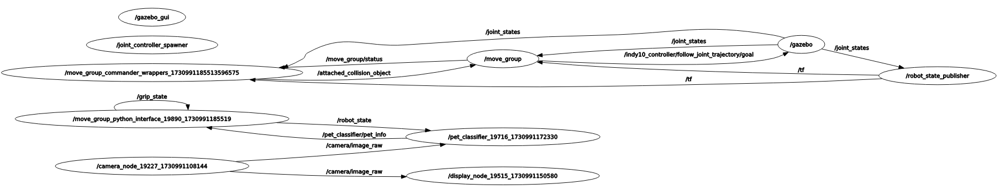

# LAB: Pet Feeder Robot

Industrial AI & Automation 2024

**Name:**  Jin Kwak/21900031

**Date:**  2024/11/07

**[Demo Video](https://www.youtube.com/watch?v=wKnrYjKV_fs)**

---

## Introduction

This lab aims to implement an automated Pet Feeder Robot using ROS, with a pet classifier via camera.

<p>Figure 1. Pet Feeder</p>


## System Requirements

- Hardware
  - Robot: Indy 10(Robot IP: 192.168.0.8)
  - Camera: PC built-in camera (or USB camera)
- Software
  - Ubuntu 20.04
  - ROS Noetic
  - Pytorch (to use an Image-Net)

## Pet Feeder Robot System

<p>Figure 2. Flow Chart</p>

<p>
    
    Figure 3. RQT Graph
</p>


## Procedure

### Nodes Design

The main nodes for this robotic system are listed below.

- Camera
  - This node generate image data from camera sensor
  - publish `camera/image_raw`
- Image display
  - This node shows image view to the user
  - Subscribe 
- Pet Classifier
  - This node classifies objects(in the project, there are Golden Retriever and Tabby Cats)
  - Subscribe
  - Publish
- Pet feeder robot (=move_group_python_interface)
  - This node manipulates Indy10 Robot
  - Subscribe

### ROS Programming

- Write source code for nodes in `catkin_ws/src/indy_driver/src`

  - `camera.py`

    ```python
    import rospy
    import cv2
    from sensor_msgs.msg import Image               
    from cv_bridge import CvBridge, CvBridgeError   
    
    class CameraNode:
        def __init__(self):
            self.bridge = CvBridge()                # cv_bridge 객체 생성
            self.image_pub = rospy.Publisher("camera/image_raw",Image,queue_size=1)    # "camera/image_raw"라는 토픽으로 메시지를 publish할 publisher 객체 생성
            self.cap = cv2.VideoCapture(0)          # 카메라 연결을 위한 VideoCapture 객체 생성
    
        def run(self):
            rospy.init_node('camera_node', anonymous=True)  # 노드 이름 "camera_node"로 초기화
            rate = rospy.Rate(30)                           # 루프 실행 주기 : 30hz
            while not rospy.is_shutdown():                  # ROS가 종료되지 않은 동안
                ret, frame = self.cap.read()                # 카메라로부터 이미지를 읽음
                if ret:                                     # 이미지가 정상적으로 읽혀진 경우
                    try:
                        # 읽어들인 이미지를 ROS Image 메시지로 변환하여 토픽으로 publish
                        self.image_pub.publish(self.bridge.cv2_to_imgmsg(frame, "bgr8"))                
                    except CvBridgeError as e:
                        print(e)                            # CvBridge 변환 예외 처리
                rate.sleep()                                # 지정된 루프 실행 주기에 따라 대기
    if __name__ == '__main__':
        try:
            camera = CameraNode()       # CameraNode 객체 생성
            camera.run()                # run 메서드 실행
        except rospy.ROSInterruptException:
            pass
    ```

  - `image_display.py`

    ```python
    import rospy
    from sensor_msgs.msg import Image   # sensor_msgs 패키지로부터 Image 메시지 타입을 import
    from cv_bridge import CvBridge      # cv_bridge 라이브러리 : OpenCV 이미지와 ROS 메시지 간의 변환 가능
    import cv2                          # OpenCV 라이브러리
    class DisplayNode:
        def __init__(self):
            self.bridge = CvBridge()
            self.image_sub = rospy.Subscriber("camera/image_raw",Image,self.callback)  # camera/image_raw 토픽에서 Image 메시지 수신
        def callback(self,data):
            try:
                # 수신된 Image 메시지를 OpenCV 이미지로 변환
                cv_image = self.bridge.imgmsg_to_cv2(data, "bgr8")  
            except CvBridgeError as e:
                print(e)
            cv2.imshow("Camera", cv_image)  # 변환된 이미지를 "Camera"라는 이름의 윈도우에 표시
            cv2.waitKey(1)                  # 1ms 동안 키보드 입력 대기
        def run(self):
            rospy.init_node('display_node', anonymous=True) # 노드 초기화 및 이름 설정
            rospy.spin()                                    # 노드가 종료될 때까지 계속 실행
    if __name__ == '__main__':
        try:
            display = DisplayNode()     # DisplayNode 클래스의 인스턴스 생성
            display.run()               # 노드 실행
        except rospy.ROSInterruptException:
            pass
    ```

  - `pet_classifier.py`

    ```python
    import rospy
    from sensor_msgs.msg import Image   # sensor_msgs 패키지로부터 Image 메시지 타입을 import
    from cv_bridge import CvBridge, CvBridgeError      # cv_bridge 라이브러리 : OpenCV 이미지와 ROS 메시지 간의 변환 가능
    import cv2                          # OpenCV 라이브러리
    import numpy as np
    import torch
    from torchvision import models
    from torchvision.models import AlexNet_Weights
    from PIL import Image as PILImage
    from torchvision import transforms
    import torch.nn.functional as F
    import json
    import urllib
    from indy_driver.msg import robot_state, pet_info
    transforms = transforms.Compose([
                    transforms.Resize(256),
                    transforms.CenterCrop(224),
                    transforms.ToTensor(),           
                    transforms.Normalize(
                        mean=[0.485, 0.456, 0.406],
                        std=[0.229, 0.224, 0.225]
                )])
    # ImageNet 클래스 레이블을 로드하는 함수
    def load_imagenet_labels():
        url = "https://raw.githubusercontent.com/anishathalye/imagenet-simple-labels/master/imagenet-simple-labels.json"
        filename = "imagenet_classes.json"
        urllib.request.urlretrieve(url, filename)
        with open(filename, 'r') as f:
            return json.load(f)
    class PetClassifierNode():
        def __init__(self, labels):
            rospy.init_node('pet_classifier', anonymous=True) # 노드 초기화 및 이름 설정
            self.bridge = CvBridge()
            self.bAction = False
            # Subscriber
            self.sub_image = rospy.Subscriber("camera/image_raw", Image, self.action)  # camera/image_raw 토픽에서 Image 메시지 수신
            self.sub_robot = rospy.Subscriber("robot_state", robot_state, self.chk_robot)  # camera/image_raw 토픽에서 Image 메시지 수신
            # Publisher
            self.pub_pet_info = rospy.Publisher('pet_classifier/pet_info', pet_info, queue_size=10)
            # Model init
            self.model = models.alexnet(weights=AlexNet_Weights.DEFAULT)
            self.model.eval()
            self.labels = labels
            # Message Control Variables
            self.bSend = False
            self.bAction = False
            self.pet_info = pet_info()
            self.thresh_cnt = 5
            self.chk_cnt = 0    
            self.pet_id_prev = 0
            self.pet_id_curr = 0
        def chk_robot(self,robot_state):
            if robot_state.move == 1:
                self.bAction = False
            else:
                self.bAction = True
        def action(self,data):
            if self.bAction:
                try:
                    # 수신된 Image 메시지를 OpenCV 이미지로 변환
                    cv_image = self.bridge.imgmsg_to_cv2(data, "bgr8") 
                    # OpenCV 이미지를 PIL 이미지로 변환
                    pil_image = PILImage.fromarray(cv2.cvtColor(cv_image, cv2.COLOR_BGR2RGB))
                    # 이미지 전처리
                    input_tensor = transforms(pil_image)
                    input_batch = input_tensor.unsqueeze(0)  # 배치 차원 추가
                    # model 예측
                    with torch.no_grad():
                        output = self.model(input_batch)
                        percentages = F.softmax(output, dim=1)[0] * 100
                        _, indices = torch.sort(output, descending=True)
                        label = self.labels[indices[0][0]]
                        if label == "tabby cat":
                            self.pet_id_curr = 1
                        elif label == "Golden Retriever":
                            self.pet_id_curr = 2
                            print("Detecting Retriever")
                        else:
                            self.pet_id_curr = 0
                        if (self.pet_id_curr == self.pet_id_prev) and self.pet_id_curr != 0:
                            self.chk_cnt += 1
                        else:
                            self.chk_cnt = 0
                        if self.chk_cnt >= self.thresh_cnt:
                            self.chk_cnt = 0
                            self.bSend = True
                        if self.bSend:
                            self.pet_info.name = label
                            self.pub_pet_info.publish(self.pet_info)
                            self.bSend = False
                        self.pet_id_prev = self.pet_id_curr
                        rospy.loginfo("%s, %d, %d",label, self.pet_id_curr, self.chk_cnt)
                except Exception as e:
                    print(e)
    
        def run(self):
            rospy.spin()                                    # 노드가 종료될 때까지 계속 실행
    
    
    if __name__ == '__main__':
        try:
            # ImageNet 레이블 로드
            imagenet_labels = load_imagenet_labels()
            pet_classifier = PetClassifierNode(imagenet_labels)       # CameraNode 객체 생성
            pet_classifier.run()                # run 메서드 실행
        except rospy.ROSInterruptException:
            pass
    ```

  - `pet_feeder.py`

    In the lab, quantity of pet food is 1, 3 respectively for 

    ```python
    import sys
    import rospy
    import moveit_commander
    import moveit_msgs
    import geometry_msgs
    
    import tf
    import numpy as np
    
    from math import pi
    
    from move_group_python_interface import MoveGroupPythonInterface
    from indy_driver.msg import pet_info
    
    DEG2RAD = pi/180
    RAD2DEG = 180/pi
    
    tau = 2*pi
    
    feed_info = { "pt_A_top" :  { "tabby cat" : np.array([- 1/6, 0, 1/4, 0, 1/4, 0])*tau ,
                                  "Golden Retriever" : np.array([- 1/6, 0, 1/4, 0, 1/4, 0])*tau },
                  "pt_A_bottom":{ "tabby cat" : np.array([0, 0, 1/10, 0, - 1/10, 0])*tau ,
                                  "Golden Retriever" : np.array([0, 0, 1/10, 0, - 1/10, 0])*tau },
                  "pt_B_top" :  { "tabby cat" : np.array([1/16, 0, 1/4, 0, 1/4, 0])*tau ,
                                 "Golden Retriever" : np.array([1/16, 0, 1/4, 0, 1/4, 0])*tau },
                  "pt_B_bottom":{ "tabby cat" : np.array([1/8, 0, 1/12, 0, - 1/12, 0])*tau ,
                                 "Golden Retriever" : np.array([1/8, 0, 1/12, 0, - 1/12, 0])*tau },
                                 "quantity" : {"tabby cat": 1,
                                               "Golden Retriever": 3},
                  "up_A" :      { "rel_xyz" : [0.0, 0.0, 0.200] ,
                                 "rel_rpy"  : [0.0, 0.0, 0.0] },
                  "down_A" :    { "rel_xyz" : [0.0, 0.0, -0.200] ,
                                 "rel_rpy"  : [0.0, 0.0, 0.0] },
                  "up_B" :      { "rel_xyz" : [0.0, 0.0, 0.150] ,
                                 "rel_rpy"  : [0.0, 0.0, 0.0] },
                  "down_B" :    { "rel_xyz" : [0.0, 0.0, -0.150] ,
                                 "rel_rpy"  : [0.0, 0.0, 0.0] }
    }
    
    class PetFeederNode():
        def __init__(self):
            # rospy.init_node('pet_feeder', anonymous=True) # 노드 초기화 및 이름 설정
    
            # Subscriber
            self.sub_pet_class = rospy.Subscriber("pet_classifier/pet_info", pet_info, self.feed)  # camera/image_raw 토픽에서 Image 메시지 수신
    
            # Robot initialization
            self.robot = MoveGroupPythonInterface(real=True, gripper="Vaccum")
            self.robot.move_to_standby()
    
            self.robot.grip_off()
        
        def feed(self, pet_info):
            
            for i in range(feed_info["quantity"][pet_info.name]):
                
                # point A
                # go_to_pose_abs(self, absolute_xyz, absolute_rpy)
                self.robot.go_to_joint_abs(feed_info["pt_A_top"][pet_info.name])
                self.robot.go_to_pose_rel(feed_info["down_A"]['rel_xyz'], feed_info["down_A"]['rel_rpy'])
                self.robot.grip_on()
                self.robot.go_to_pose_rel(feed_info["up_A"]['rel_xyz'], feed_info["up_A"]['rel_rpy'])
    
                # point B
                self.robot.go_to_joint_abs(feed_info["pt_B_top"][pet_info.name])
                self.robot.go_to_pose_rel(feed_info["down_B"]['rel_xyz'], feed_info["down_B"]['rel_rpy'])
                self.robot.grip_off()
                self.robot.go_to_pose_rel(feed_info["up_B"]['rel_xyz'], feed_info["up_B"]['rel_rpy'])
    
            self.robot.move_to_standby()
                
        def run(self):
            rospy.spin()                                    # 노드가 종료될 때까지 계속 실행
    
    if __name__ == '__main__':
        try:
            pet_feeder = PetFeederNode()
            pet_feeder.run()                # run 메서드 실행
        except rospy.ROSInterruptException:
            pass
    ```

  - The source codes were provided in [UR5e-Execution](https://github.com/ykkimhgu/HGU_IAIA/blob/main/Tutorial/TU_ROS/tutorial/ur5e/ur5e-robot-execution.md), and needs to be appropriately modified.

- add message in `catkin_ws/src/indy_driver/msg`

  - `pet_info.msg`

- modify the file `CMakeList.txt` in `catkin_ws/src/indy_driver`

- Make `.launch` file

### Simulation

Write the code here to run the simulation in the terminal

- terminal 1

```bash
roslaunch indy10_gazebo indy10_moveit_gazebo.launch 
```

- terminal 2

```bash
rosrun indy_driver camera.py
```

```bash
rosrun indy_driver image_display.py
```

```bash
rosrun indy_driver pet_classifier.py
```

```bash
rosrun indy_driver pet_feeder.py
```

### Robot Execution

The bash command for robot execution are the following:

- terminal 1

```bash
roslaunch indy10_moveit_config moveit_planning_execution.launch robot_ip:=192.168.0.8
```

- terminal 2

```bash
rosrun indy_driver camera.py
```

```bash
rosrun indy_driver pet_classifier.py
```

```bash
rosrun indy_driver image_display.py
```

```bash
rosrun indy_driver pet_feeder.py
```

Some of the python files may need pytorch from Anaconda environment.

## Discussion

1. The DL model used in the lab is not accurate enough, threshold of count consecutive frame is 5 as the model cannot classify 'Golden Retriever' and 'Tabby Cat' well.
2. For golden retriever, the feeder acts 3 times where tabby cat acts one time.
