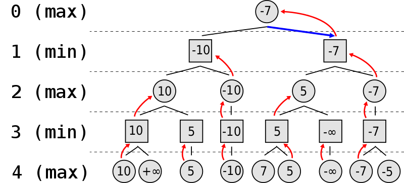
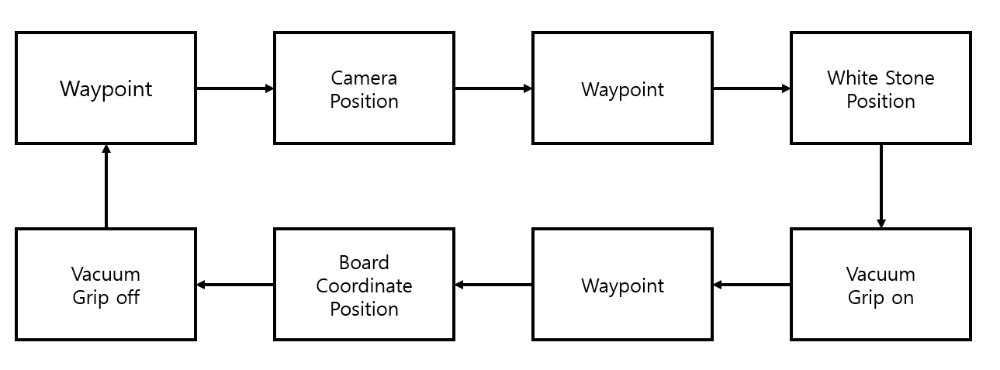

# Project: Robot Automation

##  Automation of  Gomoku and Checkers game in real-world application using UR5e robot

#### Authors

- Jin Kwak(21900031)

- Gyeonheal An(21900416)

- Soonho Lim(21900610)

- Taegeon Han(21900793)

#### Date: 2024.12.20

#### [GitHub Link](https://github.com/Kwak-Jin/IAIA/tree/master/Project/Robot%20Automation)

#### [Demo Video](https://www.youtube.com/shorts/mUcocR8j0AY)

####  [Program Guideline in Korean](https://github.com/Kwak-Jin/IAIA/blob/master/Project/Robot%20Automation/Program%20Guideline.md) or [Program Guideline in English](#Command)

#### [User guideline](https://github.com/Kwak-Jin/IAIA/blob/master/Project/Robot%20Automation/Instruction.md)

#### [Source code](https://github.com/Kwak-Jin/IAIA/tree/master/Project/Robot%20Automation/src) 	
## 1. Introduction

### 1.1 Overview

#### Background

Since AlphaGo computed stone coordinates results were made by a substitute driver during the game, the advanced software for the hardware is considered. The idea of physical operation of AlphaGo(Google DeepMind) in Gomoku and Checkers game is the motivation of this project. By designing the combination of hardware and software using a vision sensor and robot will provide a user-friendly service. In this project, users may interact with an intelligent co-robot by playing games by themselves. This project aims to address this technical gap and propose a new paradigm for user's game interactions.

#### Objective

Implementation of automation process using a co-robot has been an important task in manufacturing industry or even in everyday life.

To collaborate with robot, it is important to achieve several tasks as below:

- Intelligent decision-making using AI algorithms
- Apply sensor technology to recognize and respond human interaction in real-time
- Design a ROS-based robot control system for the UR5e to perform physical tasks

#### Goal

- Win rate of both gomoku and checkers algorithm: 80% 
- Classification of stones accuracy: over 95%
- Position detection of stones accuracy: over 95%

#### Expected outcome

- **Educational use**: The proposed AI robotic omok/checkers platform will be available in areas such as education for children.
- **Entertainment**: this project offers an innovative gaming experience through robot collaboration thus enhancing user's engagement.
- **Industrial potential**: integration of AI and robot may contribute to advancements in manufacturing automation and precise task performances by integration of AI and robotic systems
- **Encouraging interest in engineering**: the project may inspire and motivate freshmen who are considering to choose school of mechanical and control engineering as their major by showcasing the integration of robotics and AI in real-world application. 

### 1.2. Requirement

#### Software

- OS: Linux Ubuntu 20.04
- Programming Language: Python 3.8
- ROS: ROS Noetic
- Virtual Environment: Anaconda
- Additional packages required

  - Tensorflow >= 2.0.0

  - OpenCV >= 4.9.0

  - rospy

  - numpy >= 2.0.0

  - moveit_ros_planning

- Additional Ubuntu utility programs
  - terminator
  - Visual Code


To build overall software setting, follow the [link](https://github.com/hyKangHGU/Industrial-AI-Automation_HGU/tree/main/tutorial/ubuntu) for extra guideline.

#### Hardware

- Co-Robot: [6]UR5e 
  - Payload: 5kg
  - Reach: 850mm
  - Degree of freedom: 6 rotating joints


- Gripper: Vacuum gripper
- Camera: ODROID USB-CAM 720P
- Camera holder

<p align='center'> <br> Figure 1. Camera holder</p>

Camera holder is designed and 3D printed. Camera holder is attached to the robot arm as figure 1.

- Stone tray

<p align='center'> <br> Figure 2. Stone tray</p>

For Gomoku game, the robot should be able to reload a new stone. To regularize the robot action, stone tray is designed and placed near UR5e robot.

- Game board

- Optic table

<p align='center'> <br>Figure 3. Optic table</p>

The table is designed for UR5e robot, game board, stone tray to be fixed in right position. 

In the table below,  distance between each grid are listed.

|                            | **transverse direction distance [m]** | **longitudinal direction distance [m]** |
| :------------------------: | :-----------------------------------: | :-------------------------------------: |
|      **Gomoku board**      |                0.0355                 |                 0.0355                  |
|     **Checkers board**     |                0.0625                 |                 0.0625                  |
| **Stone tray for loading** |                 0.039                 |                 0.03945                 |

## 2. Task

To accomplish project goals, several tasks in the project are listed.

### 2.1  Task for both Gomoku and Checkers

- Detection of stone position on game board  
- Detection of user's newly placed/updated stone position
- Calculation of robot's next stone coordinates
- Use of vacuum gripper to pick and place stone

### 2.2. Task description for Gomoku

-  Reloading of stone on the stone tray every time

**Steps for Gomoku**

1. User places stone(User interaction) while the robot goes to a camera capture position
2. Image capture
3. Image processing for newly placed stone detection
4. Coordinates of the stone is published to the gomoku calculation process
5. Gomoku algorithm gives new coordinates for robot
6. Robot places stone on the new coordinates.
7. Robot reloads a stone
8. Repeat 1~7 until there is an end.

### 2.3. Task description for Checkers game

- Detection of change of stone's position within the board
- Update removed stone/moved stone.

**Steps for Checkers**

1. User makes a stone coordinate change in diagonal direction
2. Image capture
3. Image processing for the change in the checkers board
4. Changes of stone is detected then Checkers algorithm finds the optimal move for the white stone
5. Robot grips the white stone and place it to the other coordinates
6. Robot goes to the camera capture position
7. Repeat 1~6 until game finishes

## 3. Algorithm

### 3.1. Logic Design

Based on the tasks listed above, system's flowchart is drawn as below:

<p align='center'> <br>		Figure 4. Flowchart</p>

Flowchart is divided into processes and these processes can be drawn as RQT(simplified) graph as below:

<p align='center'><br>	 	Figure 5. simplified RQT graph</p>

Each block except `human interaction` represents each python execution files. Each arrow represents message or information. 

1. Gomoku/Checkers algorithm: `checkers.py` or `gomoku.py`
2. UR5e: `mc.py` for checkers game or `gomoku_move.py`
3. Camera:  `gomoku_image_capture.py` or `mc.py`
4. Image Processing and Display: `gomoku_image_processing.py` or `mc.py`

#### 3.1.1. Image Processing

For better image processing, there is a green padding around the game board(Figure 6) in order to separate game board with the surrounding environment.

<p align='center'><br> 	Figure 6. Game board</p>

Overall process after image capture is described as a small flowchart in Figure 7.

<p align='center'><br>Figure 7. Image Process</p>

**Step 1. Image Capture:**

To capture an image with the whole board detected by camera, the end effector should be high enough. To achieve this, joint angles are calibrated manually as below.

```python
init_pose_joints = [pi*0.472, -pi*0.534, pi*0.064, -pi*0.127, -pi*0.493, -pi*0.021] 
```

When joint angle is adjusted, the end effector is placed as Figure 8 and the captured image is in figure 9.

<p align='center'><br>	 Figure 8. Robot position while capturing image </p>

<p align='center'> <br>	Figure 9. Image from the view</p>

The captured image in gomoku algorithm is saved as `captured_image.jpg` and this image is later used in `gomoku_image_processing.py`. The most important reason for saving image is debugging. Furthermore, saving an image may enables resumption of the program after emergency stop.

**Step 2. Detect the game board and warp perspective:**

To detect the game board in the image, Perspective Transformation is used. The four corner points of the board are specified and a new perspective transformation matrix is calculated based on these points. The specified points are mapped to a $$400\times400$$ pixel image. This enables transformation of pixel coordinate to grid coordinate.

- `cv2.undistort()` is used for camera calibration.
- `cv2.getPerspectiveTransform()` is used to generate the transformation matrix.
- `cv2.warpPerspective()` is used to warp the image, creating a top-down view of the board.

**Step 3. Find black stones on the game board:**

The program iterates through the grid intersections, defining a small rectangular region around each point and calculating the average BGR value for that region. It then checks if the calculated average color falls within the range for black stones (dark color). If the specified condition is met, the region is identified as a black stone, and the position of the black stone is marked.

**Step 4. Find the newly placed stone:**

The coordinates of existing stones are loaded from a text file `user_idx.txt` and compared with the newly detected black stones. The previously placed stone coordinates are read from the text file, and the newly detected black stones are compared with the existing positions. A list of new stone coordinates is generated by excluding the previously placed stones.

```python
new_stone_coord = [item for item in black_idx if item not in user_idx]
```

- `black_idx`: A list of coordinates for newly detected black stones.
- `user_idx`: A list of coordinates for existing stones loaded from the file.
- `new_stone_coord`: A list containing only the newly detected stone coordinates

After detection  of new stone, the coordinates are saved in the text file for further application. After that, the newly detected coordinates of the stone are displayed on the image in figure 10.

<p align='center'> <br>	Figure 10. Result on monitor</p>


**Step 5. Publish the newly placed stone coordinates:**

It is issued through ROS messages so that the coordinates of the newly detected stone can be used by other nodes. Coordinate data is delivered in the form of `Int32MultiArray` messages.

```python
for coord in new_stone_coord:
    stone_msg = Int32MultiArray()
    stone_msg.data = [int(coord[0]), int(coord[1])]
    rospy.loginfo(stone_msg)
    self.pub_new_stone.publish(stone_msg)
```

#### 3.1.2. Game algorithm

#### 3.1.2a. Gomoku algorithm

In the project, an AlphaZero based [omok open source](https://github.com/DahamChoi/omok/) is used. [AI model](https://github.com/DahamChoi/omok/tree/master/model) is downloaded from the same open source. 

Reinforcement learning used in the game is consisted of dual network(policy network and value network). 

1. **Policy Network**: the network provides a Boltzmann probability distribution for all the possible moves, such that indicates the likelihood of each move as optimal move. This helps guiding the **Monte Carlo Tree Search(MCTS)** by considering the promising moves based on learning strategies first.
2. **Value Network**: the calculation of probability of winning from the game state. This evaluation helps the searching algorithm to access the quality of states with less iteration.
3. **Monte Carlo Tree Search(MCTS)**: finds the best result(decision-making) by simulations. The MCTS is subdivided into 3 sections:
   1. Tree Node: Stores information
   2. Simulation Process: Evaluation of potential movement
   3. Action Selection : Highest visited move(Optimal move) is selected.
4. Rewards and Feedback

   1. Winning provides a reward of 1 
   2. Losing provides -1.

   This structure ensures the network learns to maximize long-term strategic outcomes, rather than immediate outcome.

Architecture of the program gives such **strengths** in decision-making:

- **Efficient Exploration**: Policy network as explained above reduces the brute-force like searching by focusing on promising states.
- **Generalization through Residual Networks**: Residual network gives learning stability and preserve the input characters.
- **Easy modification**: the architecture's structure is flexibile and can be extended to larger board sizes(In the project, grid size was $$15\times15$$) or different policies.

####  3.1.2b. Checkers algorithm

In this project, another [open source for checkers game](https://github.com/bushra2001/Checkers) is used. The Checkers game is the process of checking the status of the game board and playing a checkers game between the player and the computer. To this end, image processing and robot manipulation are combined to automate the progress of the Checkers game. Checkers game uses **Minimax Algorithm**.

<p align='center'> <br>	Figure 11. Structure of Minimax Algorithm </p>

The **Minimax Algorithm** is a decision-making strategy often used in games like checkers. The core idea of the algorithm is to predict the opponent's moves under the assumption that the opponent will always make the best possible decision (which is the worst for the algorithm). Based on this assumption, the algorithm evaluates the outcomes and selects the optimal move for the current turn. Figure 11 illustrates a 4-move-ahead Minimax decision tree. Odd-numbered levels (1 and 3) represent the opponent's turns, while even-numbered levels represent the algorithm's turns. On the algorithm's turns, it selects the best possible move, aiming for the highest score. Conversely, on the opponent's turns, it assumes the opponent will make the worst possible choice for the algorithm, as a rational opponent would never choose a move that benefits the algorithm. 

```python
def minimax(board, depth, alpha, beta, maximizing_player, mandatory_jumping)
```

**The sequences of decisions are the following:**

1. **4th row (algorithm's turn):** The algorithm evaluates and assigns values to its possible moves: 10, +∞, 5, -10, 7, 5, -∞, -7, -5
2. **3rd row (opponent's turn):** The opponent selects the worst possible outcome for the algorithm from the 4th row. This results in: 10, 5, -10, 5, -∞, -7
3. **2nd row (algorithm's turn):** The algorithm then selects the best possible outcome from the 3rd row (relatively higher values). The result is: 10, -10, 5, -7

4. **1st row (opponent's turn):** The opponent once again chooses the worst possible outcome for the algorithm. The result is: -10, -7.

5. **0th row (current turn, algorithm's move):** Finally, the algorithm selects the best choice from the 1st row. The optimal move is -7.

**Maximizing Player's Turn**

1. Start with the lowest possible score (`-∞`).
2. For each possible move, calculate the result of that move by calling `minimax` recursively.

3. Update `max_eval` to keep track of the best move.

4. Use Alpha-Beta Pruning (`if beta <= alpha`) to skip unnecessary branches.

```python
if maximizing_player is True:
    max_eval = -math.inf
    for child in current_state.get_children(True, mandatory_jumping):
        ev = Checkers.minimax(child.get_board(), depth - 1, alpha, beta, False, mandatory_jumping)
        max_eval = max(max_eval, ev)
        alpha = max(alpha, ev)
        if beta <= alpha:
            break
    current_state.set_value(max_eval)
    return max_eval
```

**Minimizing Player's Turn**

1. Start with the highest possible score (`+∞`).
2. For each possible move, calculate the result of that move by calling `minimax` recursively.

3. Update `min_eval` to keep track of the worst-case scenario for the algorithm.

4. Use **Alpha-Beta Pruning** (`if beta <= alpha`) to skip unnecessary branches.

```python
else:
    min_eval = math.inf
    for child in current_state.get_children(False, mandatory_jumping):
        ev = Checkers.minimax(child.get_board(), depth - 1, alpha, beta, True, mandatory_jumping)
        min_eval = min(min_eval, ev)
        beta = min(beta, ev)
        if beta <= alpha:
            break
    current_state.set_value(min_eval)
    return min_eval
```

**Alpha-Beta Pruning**

Alpha-Beta Pruning is used to avoid exploring branches that won’t affect the final decision:

* **Alpha**: The best score the maximizing player can guarantee.
* **Beta**: The best score the minimizing player can guarantee.

When alpha >= \beta, further exploration is unnecessary because the current branch won’t affect the outcome.

#### 3.1.3. Robot manipulation

There are 2 ways to control UR5-e robot:

<p align='center'> <br>	Figure 12. Robot Kinematics</p>

1. Adjusting robot's joint angles using a method `go_to_joint_abs(joint_angles)` in `MoveGroupPythonInterface` class.
   - Easy to control a robot movement.
   - The displacement of an end-effector is not known
   - Forward Kinematics
2. Adjusting robot's final displacement using a method `go_to_pose_rel(xyz_position, end_effector_angle)` in `MoveGroupPythonInterface` class.
   - Easy to move a robot by changing end effector's relative displacement
   - The angle of an end-effector should be calculated by numerically(Jacobian Matrix)
   - Inverse Kinematics
   - Sometimes, this control method may have multiple solutions of joint angles and this may cause trouble [as shown in troubleshooting](#Troubleshooting).

End-effector should always face down while picking or placing a stone. Therefore, end-effector's angle is always set as below. 

```python
grip_pose_rpy = [0.00, 0.00, 0.00]
```

To manipulate a robot to a certain end-effector position, inverse kinematics is often used. To do this in automated manner, the robot always visit the waypoint which is considered as the reference position

```python
waypoint_init_pose_joints = [tau/4, -tau/4, tau/4, -tau/4, -tau/4, 0.0]
```

#### 3.1.3a. Robot manipulation for Gomoku game

Simple flowchart of the robot manipulation is in figure 13.

<p align='center'><br>	 Figure 13. Manipulation Flowchart</p>

To move the end-effector to the stone tray and the game board with uniform movement, the original position of gomoku is calculated. The first coordinate represents stone reloading position(original or $$(0,0)$$ in mathematical term) and the second one represents game board coordinates($$(0,0)$$ in the grid). As the game board grid is always $$0.0355 [m]$$, addition to the x position and y position to the original coordinates will result in the placement coordinate of a robot's stone.

```python
grip_pose_xyz = [00.0, -0.00, -0.023]
```

```python
target_pose_abs_xyz = [-0.190, 0.3025, -0.305]
```

If the coordinate information for robot is received(`self.cmd_x` and `self.cmd_y`), the coordinate is calculated as below

```python
target_pose_abs_xyz_go = [target_pose_abs_xyz[0]+self.cmd_x*grid_jump, target_pose_abs_xyz[1]-self.cmd_y*grid_jump,-0.304] rospy.sleep(0.5)
self.ur5e.go_to_pose_rel(target_pose_abs_xyz_go, target_pose_abs_rpy)
self.ur5e.grip_off()
```

For the same principle, grip of stone from stone tray is also calculated using `x_jump = 0.039` and `y_jump = 0.03945`.

```python
be_grip_pose_xyz = [0.103 + cnt_y*x_jump, -0.198 + cnt_x*y_jump, -0.2]   
...
# Update stone tray position indices 
cnt_x = cnt_x + 1
if cnt_x == 10:
    cnt_x = 0
    cnt_y = cnt_y + 1
if cnt_y == 3:
    # Reset tray position to the original position
    cnt_x = 0
    cnt_y = 0
```

#### 3.1.3b. Robot manipulation for Checkers game

Simple flowchart of the robot manipulation is in figure 14.

<p align='center'> <br> Figure 14 Simple Flowchart for robot manipulation(checkers)</p>


The robot moves from top to bottom and grips. The up and down relative position change is defined as below. 

```python
grip_pose_xyz = [00.0, -0.00, -0.02]
```

The first one represents the spacing and initial coordinates of the checkerboard. The distance of each grid is $$0.0625[m]$$, and the stones should be placed between the compartments, not at the intersection. Therefore, after identifying the location where the stones should be placed, the space between the compartments is calculated as below(second one) by receiving the values of self.x and self.y, which are the coordinate information of the robot.

```python
jump = 0.0625
init_point_x = 0.313-jump/2
init_point_y = -0.192+jump/2

target_pose_abs_xyz = [init_point_x, init_point_y]

target_pose_abs_xyz_go = [target_pose_abs_xyz[0]-(self.x2)*jump-(self.y2)*0.001, target_pose_abs_xyz[1]+(self.y2)*jump-(self.x2)*0.0012,-0.313]
time.sleep(1)   
self.ur5e.go_to_pose_rel(target_pose_abs_xyz_go, target_pose_abs_rpy)        # Grip off position
time.sleep(1)
self.ur5e.grip_off()
```

If the robot moves directly to the calculated coordinates, it moves only in a diagonal direction, so the vacuum gripper may touch the stone, changing the position of the stone and not accurately gripping it. To prevent this, a waypoint is set to move to x, y coordinates, and then set it to move separately in the z direction to accurately hold the stone.

```python
target_pose_abs_xyz_go = [0, 0, -0.043]
...

self.ur5e.go_to_pose_rel(target_pose_abs_xyz_go, target_pose_abs_rpy)        # Grip on position
time.sleep(1)
self.ur5e.grip_on()
```

When the robot had to pick up or leave stones over a long distance, it visits a waypoint in the middle to ensure smooth switching between locations and reduce the risk of collision.

### 3.2. Code

#### Structure

The **file structure** for both gomoku and checkers game program is the following:

```
catkin_ws
  |- build
  |- devel
  |- src
  |----|- CMakeLists.txt
  |----|- ur_python
  |----|----|- msg
  |----|----|----|- object_info.msg
  |----|----|----|- robot_state.msg
  |----|----|----|- capture_flag.msg
  |----|----|----|- capture_finished_flag.msg
  |----|----|----|- ...
  |----|----|- src
  |----|----|----|- dual_network.py
  |----|----|----|- gomoku.py
  |----|----|----|- human_play.py
  |----|----|----|- omok.py
  |----|----|----|- pv_mcts.py
  |----|----|----|- checkers.py
  |----|----|----|- move_coord.py
  |----|----|----|- move_check.py
  |----|----|----|- mc.py
  |----|----|----|- omoks.cpp
  |----|----|----|- gomoku.py
  |----|----|----|- gomoku_image_processing.py
  |----|----|----|- gomoku_image_capture.py
  |----|----|----|- gomoku_move.py
  |----|----|----|- move_group_python_interface.py
  |----|----|----|- user_idx.txt
  |----|----|----|- captured_images
  |----|----|----|----|- ...
```

#### Command

Since the project is based on ROS environment, every command line is done under catkin workspace directory.

```bash
cd ~/catkin_ws
```

To activate the system, the robot should be connected to a computer. Communication protocol is TCP/IP based therefore, IP should be set in proper manner([Check the link from the chapter](#Software)).

```bash
  roslaunch ur_robot_driver ur5e_bringup.launch robot_ip:=192.168.0.2 
  roslaunch ur5e_rg2_moveit_config move_group.launch
```

Each program are individual process and does not have any dependency on each other.

1. Option: Checkers Program

Before running the checkers game, put stones on the board in correct manner. The checkers board is on the other side of gomoku board. The board should be in a fixed position where the board aligns with the stone tray.

```bash
conda activate py38
rosrun ur_python checkers.py
rosrun ur_python mc.py
```

2. Option: Gomoku Program

To run gomoku game, clear all the stones from the gomoku board. Follow the commands below(Order does not matter running the program). 

```bash
rosrun ur_python gomoku_image_capture.py
rosrun ur_python gomoku_image_processing.py
rosrun ur_python gomoku_move.py
```

In the following command, gomoku algorithm process is activated in virtual environment. (If there is a tensorflow package in the local python path, conda activation is not required)

```bash
conda activate py38
rosrun ur_python gomoku.py
```

For a simple run, `run_gomoku.sh` enables multi command at once.

```sh
#!/bin/bash

# About: Gomoku Program .sh file
# Created: 2024.12.10
# Author: Jin Kwak, Gyeonheal An
#!/bin/bash

# ROS environment setup
source /opt/ros/noetic/setup.bash
source ~/catkin_ws/devel/setup.bash

roslaunch ur_robot_driver ur5e_bringup.launch robot_ip:=192.168.0.2 &
sleep 5 

roslaunch ur5e_rg2_moveit_config move_group.launch &
sleep 10
echo "Success: Connect with the Robot."

gnome-terminal -- bash -c "source /opt/ros/noetic/setup.bash; source ~/catkin_ws/devel/setup.bash; rosrun ur_python gomoku_image_capture.py; exec bash"

gnome-terminal -- bash -c "source /opt/ros/noetic/setup.bash; source ~/catkin_ws/devel/setup.bash; rosrun ur_python gomoku_image_processing.py; exec bash"

gnome-terminal -- bash -c "source /opt/ros/noetic/setup.bash; source ~/catkin_ws/devel/setup.bash; rosrun ur_python gomoku_move.py; exec bash"

echo "Gomoku Program is launched."
```

The user can simply type below to operate several process at once. This activates image capture, image processing, UR5e control programs.

```bash
run_gomoku
```

Then following command comes for gomoku algorithm

```bash
conda activate py38
rosrun ur_python gomoku.py
```

## 4. Results

### 4.1. Results

From the stated goals, the automation program has achieved results as below.

|              Goal of the project               | Expectation  |                            Result                            |
| :--------------------------------------------: | :----------: | :----------------------------------------------------------: |
| Win rate of both gomoku and checkers algorithm | 80% Win rate | 70% for Gomoku(20 Games 14W 6L), 100% for Checkers(12 Games, 12W) |
|       Classification of stones accuracy        |     <95%     |                             100%                             |
|     Position detection of stones accuracy      |     <95%     |                             100%                             |

1. Win rate is calculated from 20 games and 12 games respectively for gomoku and checkers algorithm. 
2. Classification of stones(White and Black) is tested by the samples from [dataset](https://github.com/Kwak-Jin/IAIA/tree/master/Project/Robot%20Automation/source/gomoku/captured_images). 
3. Position detection of stones is also tested with the same dataset.
4. Average loop time of the gomoku algorithm is about 4.0 seconds where checkers game algorithm is faster(below1.0 seconds).
5. Average robot execution time for checkers is 35~40 seconds. 

[Demo Video](https://www.youtube.com/shorts/mUcocR8j0AY)

### 4.2. Discussion

1. For the classification of stones/position detection, 30 images are tested with percentage error resolution of $$3.33%$$. Throughout more than 30 games of both gomoku and checkers game, there was no misclassification or false detection of coordinates of stones. Thus, ensuring the performance of image processing in the environment(NTH 115).
2. Win rate is only tested by the developers of the project. The win rate may not be inappropriate depending on a user. Especially in Gomoku algorithm, the user may choose (Easy-Hard) AI model to adjust difficulty level.
3. The position detection of newly placed stone is only tested with single addition of stone. Multiple number of addition of stones may lead to false detection. 
4. The fixed position on optic table enabled convenient control of UR5e robot. Each hardware components can be attached to the optic table as well as UR5e robot. Thus, there are no critical change in relative position.

## 5. Conclusion

This project was successfully implemented by efficiently integrating UR5e robotic arm control, a ROS-based system(e.g. communication), and AI models. The robotic arm demonstrated reliable and precise operation using both absolute coordinates (abs) and relative coordinates (rel), ensuring stability across various tasks. Especially, the camera-based image processing technology achieved 100% accuracy in stone classification and position detection. Real-time feedback and the combination of algorithms enabled intelligent interactions based on user input. In Gomoku and Checkers games, the AI achieved win rates of 70% and 100%, respectively, demonstrating the superiority of the AI algorithm. These results demonstrated the efficiency of robot control technologies and AI models well, effectively presenting the potential for human-robot interaction in game playing.

This project effectively showcased the efficiency of robotic arm control and AI technologies while demonstrating the potential for human-robot interaction. It lays a solid foundation for future applications of collaborative robots such as (e.g. Baduk, Chess, Korean Chess), confirming their potential in various industries and everyday automation scenarios.

### Further works

1. Robot movements optimization is required. The inverse kinematic may have several solutions and further work is to get the optimal movement in 6 DOF system.
2. UI(e.g. button for selection of games, better GUI for updating current status) may provide convenience for users.
3. Upgrade on computing source is mandatory for full automation. Microcontroller unit with OS(e.g. Jetson Nano) can replace laptop.
4. The robot behaves in the promised coordinates. If the game board is not fixed at the designated place, it will place a stone in a wrong grid or position. For further application, calibration of game board position is considered.
5. Calibration of game board position and part of image processing(adaptive thresholding of red-blue-green average value)

###  Troubleshooting

1. Gomoku game program sometimes [malfunctions](https://youtu.be/F8NwCMZV67k). These malfunction problem may lead to termination of the program using emergency stop. There are 2 main ideas tested in the project to prevent this situation
   1. `rospy.sleep(time)` is used as a temporary solution to the situation. This only helps if the robot has been operated too long.
   2. Giving more waypoints on the way to the destination. To do this, relative coordinates are defined as below

   ```python
   target_pose_abs_xyz = [-0.190, 0.3025, -0.305]    # Stone Placement position
   target_pose_abs_rpy = [0.00, 0.00, 0.00]         # Default rotation angle(0,0,0)
   aaf_grip_pose_xyz = [-0.20, 0.00, 0.0]             # Relative Position after vacuum  (XYZ)
   af_grip_pose_xyz = [0.00, 0.00, 0.233]             # Relative Position after vacuum  (XYZ)
   grip_pose_xyz = [00.0, -0.00, -0.023]            # Relative Position vacuum        (XYZ)
   ```

2. Checkers game have relative less range of movement than Gomoku games because there are no additional stones to place on the board so there are fewer waypoints/destination.

   ```python
   target_pose_abs_rpy = [0.00, 0.00, 0.00]         # Default rotation angle(0,0,0)
   target_pose_abs_xyz_go = [0, 0, -0.043]          # Relative Position before vacuum (XYZ)
   init_pose_joints = [tau/4, -tau/4, tau/4, -tau/4, -tau/4, 0.0]  # waypoint between camera capture location and checkerboard
   ```

3. Communication between asynchronous processes may cause trouble within the process. To sync each steps(process), time-idling is used in the process by `while(not_changed)`. While not using time-idling, the robot may visit the previous stone coordinates on game board. To further change this inefficiency, multi-threading(like checkers game) can be suggested in a single or dual process.

<p align='center'> <br>	Figure 15. Idle/Execute process </p>

4. Image processing without deep learning is used in the project for both gomoku and checkers game. This program is only available in the environment similar to NTH 115. If tested in other environment, the average `rbg` value may differ. To use this algorithm for general situation, adaptive thresholding method can be suggested in the program.

## 6. Reference

### Appendix

[1] https://deepmind.google/research/breakthroughs/alphago/

[2] https://github.com/hyKangHGU/Industrial-AI-Automation_HGU

[3] https://github.com/Jpub/AlphaZero

[4] https://github.com/DahamChoi/omok/

[5] https://github.com/moveit/moveit

[6] https://www.universal-robots.com/media/1807465/ur5e-rgb-fact-sheet-landscape-a4.pdf

### Code Appendix

`CMakeLists.txt`

```cmake
cmake_minimum_required(VERSION 3.0.2)
project(ur_python)

find_package(catkin REQUIRED COMPONENTS
  rospy
  message_generation
  std_msgs
  message_runtime
  moveit_ros_planning
  moveit_ros_planning_interface
  moveit_visual_tools
  geometry_msgs
  image_transport
  cv_bridge
  sensor_msgs
)

find_package (OpenCV REQUIRED)

add_message_files(
  FILES
  object_info.msg
  robot_state.msg
  grip_command.msg
  grip_state.msg
  pet_info.msg
  new_stone.msg
  capture_flag.msg
  capture_finished_flag.msg
  Location.msg
  Coordinate.msg
)

generate_messages(
  DEPENDENCIES
  std_msgs
  geometry_msgs
)

catkin_package(
    LIBRARIES opencv
    CATKIN_DEPENDS 
    cv_bridge 
		image_transport
    sensor_msgs 
		std_msgs
)

include_directories(
  ${catkin_INCLUDE_DIRS}
  ${OpenCV_INCLUDE_DIRS}
)

add_executable(go src/omoks.cpp)
target_link_libraries(go ${catkin_LIBRARIES})
```

#### Gomoku Program

`bashrc` setting for Gomoku program

```bash
# If not running interactively, don't do anything
case $- in
    *i*) ;;
      *) return;;
esac

# don't put duplicate lines or lines starting with space in the history.
# See bash(1) for more options
HISTCONTROL=ignoreboth

# append to the history file, don't overwrite it
shopt -s histappend

# for setting history length see HISTSIZE and HISTFILESIZE in bash(1)
HISTSIZE=1000
HISTFILESIZE=2000

# check the window size after each command and, if necessary,
# update the values of LINES and COLUMNS.
shopt -s checkwinsize

# If set, the pattern "**" used in a pathname expansion context will
# match all files and zero or more directories and subdirectories.
#shopt -s globstar

# make less more friendly for non-text input files, see lesspipe(1)
[ -x /usr/bin/lesspipe ] && eval "$(SHELL=/bin/sh lesspipe)"

# set variable identifying the chroot you work in (used in the prompt below)
if [ -z "${debian_chroot:-}" ] && [ -r /etc/debian_chroot ]; then
    debian_chroot=$(cat /etc/debian_chroot)
fi

# set a fancy prompt (non-color, unless we know we "want" color)
case "$TERM" in
    xterm-color|*-256color) color_prompt=yes;;
esac

# uncomment for a colored prompt, if the terminal has the capability; turned
# off by default to not distract the user: the focus in a terminal window
# should be on the output of commands, not on the prompt
#force_color_prompt=yes

if [ -n "$force_color_prompt" ]; then
    if [ -x /usr/bin/tput ] && tput setaf 1 >&/dev/null; then
	# We have color support; assume it's compliant with Ecma-48
	# (ISO/IEC-6429). (Lack of such support is extremely rare, and such
	# a case would tend to support setf rather than setaf.)
	color_prompt=yes
    else
	color_prompt=
    fi
fi

if [ "$color_prompt" = yes ]; then
    PS1='${debian_chroot:+($debian_chroot)}\[\033[01;32m\]\u@\h\[\033[00m\]:\[\033[01;34m\]\w\[\033[00m\]\$ '
else
    PS1='${debian_chroot:+($debian_chroot)}\u@\h:\w\$ '
fi
unset color_prompt force_color_prompt

# If this is an xterm set the title to user@host:dir
case "$TERM" in
xterm*|rxvt*)
    PS1="\[\e]0;${debian_chroot:+($debian_chroot)}\u@\h: \w\a\]$PS1"
    ;;
*)
    ;;
esac

# enable color support of ls and also add handy aliases
if [ -x /usr/bin/dircolors ]; then
    test -r ~/.dircolors && eval "$(dircolors -b ~/.dircolors)" || eval "$(dircolors -b)"
    alias ls='ls --color=auto'
    #alias dir='dir --color=auto'
    #alias vdir='vdir --color=auto'

    alias grep='grep --color=auto'
    alias fgrep='fgrep --color=auto'
    alias egrep='egrep --color=auto'
fi

# colored GCC warnings and errors
#export GCC_COLORS='error=01;31:warning=01;35:note=01;36:caret=01;32:locus=01:quote=01'

# some more ls aliases
alias ll='ls -alF'
alias la='ls -A'
alias l='ls -CF'

# Add an "alert" alias for long running commands.  Use like so:
#   sleep 10; alert
alias alert='notify-send --urgency=low -i "$([ $? = 0 ] && echo terminal || echo error)" "$(history|tail -n1|sed -e '\''s/^\s*[0-9]\+\s*//;s/[;&|]\s*alert$//'\'')"'

# Alias definitions.
# You may want to put all your additions into a separate file like
# ~/.bash_aliases, instead of adding them here directly.
# See /usr/share/doc/bash-doc/examples in the bash-doc package.

if [ -f ~/.bash_aliases ]; then
    . ~/.bash_aliases
fi

# enable programmable completion features (you don't need to enable
# this, if it's already enabled in /etc/bash.bashrc and /etc/profile
# sources /etc/bash.bashrc).
if ! shopt -oq posix; then
  if [ -f /usr/share/bash-completion/bash_completion ]; then
    . /usr/share/bash-completion/bash_completion
  elif [ -f /etc/bash_completion ]; then
    . /etc/bash_completion
  fi
fi


source /opt/ros/noetic/setup.bash
source ~/catkin_ws/devel/setup.bash

# 환경변수 추가
export PYTHONPATH=~/catkin_ws/devel/lib/python3/dist-packages:/opt/ros/noetic/lib/python3/dist-packages
export LD_PRELOAD=/usr/lib/x86_64-linux-gnu/libtiff.so.5
# export PYTHONPATH=/opt/ros/noetic/lib/python3/dist-packages:$PYTHONPATH

# >>> conda initialize >>>
# !! Contents within this block are managed by 'conda init' !!
__conda_setup="$('/home/gyeonheal/anaconda3/bin/conda' 'shell.bash' 'hook' 2> /dev/null)"
if [ $? -eq 0 ]; then
    eval "$__conda_setup"
else
    if [ -f "/home/gyeonheal/anaconda3/etc/profile.d/conda.sh" ]; then
        . "/home/gyeonheal/anaconda3/etc/profile.d/conda.sh"
    else
        export PATH="/home/gyeonheal/anaconda3/bin:$PATH"
    fi
fi
unset __conda_setup


# 자동으로 ROS 환경 활성화
function act_ros {
    source /opt/ros/noetic/setup.bash
    source ~/catkin_ws/devel/setup.bash
    export PYTHONPATH=/opt/ros/noetic/lib/python3/dist-packages:/home/gyeonheal/catkin_ws/devel/lib/python3/dist-packages
    echo "ROS activated"
}

# 자동으로 Anaconda 환경 활성화
function act_conda {
    conda activate base
    export PYTHONPATH=/opt/ros/noetic/lib/python3/dist-packages:~/catkin_ws/devel/lib/python3/dist-packages:~/anaconda3/envs/py38/lib/python3.8/site-packages
    echo "conda activated"
}

alias re='source ~/.bashrc'
alias py38='act_conda && conda activate py38'
```


`Gomoku_move.py`

```python
#!/usr/bin/env python3
#-*- coding:utf-8 -*- 
import rospy
# from tf.transformations import *
from math import tau, pi
import numpy as np
from std_msgs.msg import Int32MultiArray
from move_group_python_interface import MoveGroupPythonInterface
from ur_python.msg import capture_flag

import sys
import os   
current_dir = os.path.dirname(os.path.abspath(__file__))
src_dir = os.path.join(current_dir, '..', 'src')
sys.path.insert(0, src_dir)
#time variable used for count down
time = 5
target_pose_abs_xyz = [-0.190, 0.3025, -0.305]    # Stone Placement position
target_pose_abs_rpy = [0.00, 0.00, 0.00]         # Default rotation angle(0,0,0)
aaf_grip_pose_xyz = [-0.20, 0.00, 0.0]             # Relative Position after vacuum  (XYZ)
af_grip_pose_xyz = [0.00, 0.00, 0.233]             # Relative Position after vacuum  (XYZ)
grip_pose_xyz = [00.0, -0.00, -0.023]            # Relative Position vacuum        (XYZ)
grip_pose_rpy = [0.00, 0.00, 0.00]               # Default Roll pitch yaw (rad)
DEG2RAD = pi/180.0
grip_abs_point = [63.11*DEG2RAD, -80.75*DEG2RAD, 90.75*DEG2RAD, -101.50*DEG2RAD, -90.17*DEG2RAD, -39.7*DEG2RAD]

init_pose_joints = [pi*0.472, -pi*0.534, pi*0.064, -pi*0.127, -pi*0.493, -pi*0.021]  # Camera position
waypoint_init_pose_joints = [tau/4, -tau/4, tau/4, -tau/4, -tau/4, 0.0]              # Original position

def count_time():
    # Time count using variable time
    print("\r")
    for k in range(time, 0, -1):
        print(f"{k}s left", end="\r")
        rospy.sleep(1)
    print("\r")
    print("Times out")
    print("\r")


class UR5e_Move_With_Camera():
    def __init__(self):
        self.ur5e = MoveGroupPythonInterface(real="real", gripper="Vacuum")
        init_pose_joints = [tau/4, -tau/4, tau/4, -tau/4, -tau/4, 0.0]          # tau = 2 * pi  원위치
        self.ur5e.go_to_joint_abs(init_pose_joints)
        
        self.msg_capture_flag = capture_flag()

        # Subscribe from Gomoku algorithm(omoks.cpp)
        self.sub_object_info = rospy.Subscriber("Ai_Stone_Coord", Int32MultiArray, self.detection_callback)
        # Publish
        self.pub_capture_flag = rospy.Publisher("capture_flag", capture_flag, queue_size=10)

        self.flag_recv_msg = False
        self.cmd_x = 0
        self.cmd_y = 0
        self.cmd_x_prev = 0
        self.cmd_y_prev = 0
        print("Initialization is completed!")

    def go_grip_stone(self,stone_pos1):
        self.ur5e.go_to_pose_rel(stone_pos1, grip_pose_rpy)
        rospy.sleep(0.5)
        self.ur5e.go_to_pose_rel(grip_pose_xyz, grip_pose_rpy)
        self.ur5e.grip_on()
        
    #Get x,y coordinates from Gomoku algorithm(c++)
    def detection_callback(self, data):
        print(f"message received: {data.data[0]}, {data.data[1]}")
        self.flag_recv_msg = True
        self.cmd_x = data.data[0]
        self.cmd_y = data.data[1]

    def go_cam_position(self):
        self.ur5e.go_to_pose_rel(af_grip_pose_xyz, grip_pose_rpy)
        #self.ur5e.go_to_pose_rel(aaf_grip_pose_xyz, grip_pose_rpy)
        #self.ur5e.go_to_joint_abs(waypoint_init_pose_joints)     # 원위치
        self.ur5e.go_to_joint_abs(init_pose_joints)      # Camera point

    def publish_capture_flag(self):
        self.msg_capture_flag = True
        self.pub_capture_flag.publish(self.msg_capture_flag)
        print(f"Capture Flag Published: {self.msg_capture_flag}")

    def run(self):
        x_jump = 0.039      # Stone tray x jump
        y_jump = 0.03945    # Stone tray y jump
        grid_jump = 0.0355  # Board Grid distance
        # Stone Tray Position indexx
        cnt_x = 0
        cnt_y = 0        
        while not rospy.is_shutdown():  
            self.cmd_x_prev = self.cmd_x
            self.cmd_y_prev = self.cmd_y      
            be_grip_pose_xyz = [0.103 + cnt_y*x_jump, -0.198 + cnt_x*y_jump, -0.2]               # Position before vacuum (XYZ)

            # Move to placed stone to grip
            self.ur5e.go_to_joint_abs(grip_abs_point)
            self.go_grip_stone(be_grip_pose_xyz)

            # Move to designated location to take a picture
            self.go_cam_position()
            
            if self.flag_recv_msg:
                
                if(self.cmd_x == - 100 and self.cmd_y == 100):
                    print("Finish Game!!\r\n")
                    break
            # else:
            #     print("Finish the game, You are a loser. Please think fastly")
            #     break
            
            self.flag_recv_msg = False

            count_time()
            self.publish_capture_flag()

            #Subscribed data from gomoku algorithm comes here
            while(self.cmd_x_prev==self.cmd_x and self.cmd_y_prev == self.cmd_y):
                continue
            if(self.cmd_x==-100 and self.cmd_y == -100):
                print("Human won!!!")
                break
            if(self.cmd_x==100 and self.cmd_y == 100):
                print("AI won!!!")
                break
            self.ur5e.go_to_joint_abs(waypoint_init_pose_joints)     # Waypoint to the stone placement
            target_pose_abs_xyz_go = [target_pose_abs_xyz[0]+self.cmd_x*grid_jump, target_pose_abs_xyz[1]-self.cmd_y*grid_jump,-0.304]  # 판에 두기
            rospy.sleep(0.5)
            self.ur5e.go_to_pose_rel(target_pose_abs_xyz_go, target_pose_abs_rpy)
            self.ur5e.grip_off()
            self.ur5e.go_to_joint_abs(waypoint_init_pose_joints)     # 원위치

            # Update stone tray position indices 
            cnt_x = cnt_x + 1
            if cnt_x == 10:
                cnt_x = 0
                cnt_y = cnt_y + 1
            if cnt_y == 3:
                # Reset tray position to the original position
                cnt_x = 0
                cnt_y = 0

def main():
    try:
        UR5e = UR5e_Move_With_Camera()
        UR5e.run()

    except rospy.ROSInterruptException:
        return
    except KeyboardInterrupt:
        return

if __name__ == "__main__":
    main()
```

`Gomoku.py`

```python
#!/usr/bin/env python3
#-*- coding:utf-8 -*- 

# 패키지 임포트
import rospy
from sensor_msgs.msg import Image   
from std_msgs.msg import Int32MultiArray, MultiArrayDimension, MultiArrayLayout
from omok import State
from pv_mcts import pv_mcts_action
from tensorflow.keras.models import load_model
import tensorflow as tf
from pathlib import Path
from threading import Thread

# GPU 비활성화
tf.config.set_visible_devices([], 'GPU')

# 흑돌 : False, 백돌 : True
FIRST_PLAY = True
# 베스트 플레이어 모델 로드
model = load_model("/home/gyeonheal/catkin_ws/src/ur_python/src/model/best.h5")

# 게임 UI 정의
class Gomoku():
    # 초기화
    def __init__(self, model=None):
        rospy.init_node('Gomoku_Alphago', anonymous=True)

        # 게임 상태 생성
        self.state = State()

        # PV MCTS를 활용한 행동 선택을 따르는 함수 생성
        self.next_action = pv_mcts_action(model, 0.0)

        self.last_position = 999
        self.fin_flag = 0
        # Publisher
        self.pub_ = rospy.Publisher('Ai_Stone_Coord', Int32MultiArray, queue_size=10)

        # Subscriber
        self.sub_ = rospy.Subscriber("User_Stone_Coord", Int32MultiArray, self.callbackfunc)

        self.user_x = -1
        self.user_y = -1
        self.user_x_prev = -2
        self.user_y_prev = -2

        print("")
        print("")
        print("**************Game has started**************")
        print("")
        print("")
        if FIRST_PLAY:
            # 사람의 턴으로 시작
            self.turn_of_human()
        else:
            # AI의 턴으로 시작
            self.turn_of_ai()

    def callbackfunc(self, data):
        self.user_x = data.data[0]
        self.user_y = data.data[1]

    # 사람의 턴
    def turn_of_human(self):

        # if self.state.is_done():
        #     print("is done Error")
        #     if FIRST_PLAY:
        #         self.state = State()
        #         self.on_draw()

        #     else:
        #         self.state = State()
        #         self.turn_of_ai()
        #         self.on_draw()
        #     return
        print("------------User's Turn------------")
        print("")
        print("--------------Pending--------------")
        print("")
        print("--------------Pending--------------")
        print("")
        print("--------------Pending--------------")
        if FIRST_PLAY:
            # 선수가 아닌 경우
            if not self.state.is_first_player():
                print("Line 75 Error")
                return
        else:
            if self.state.is_first_player():
                print("Line 78 Error")
                return

        # 범위 밖의 입력 방지
        while(self.user_x < 0 or 14 < self.user_x or self.user_y < 0 or 14 < self.user_y or(self.user_x_prev == self.user_x and self.user_y_prev == self.user_y)):
            continue
        
        print(f"Human Placed: {self.user_x}, {self.user_y}")

        self.user_x_prev = self.user_x 
        self.user_y_prev = self.user_y            
        action = self.user_x + self.user_y * 15

        # 합법적인 수가 아닌 경우
        if action not in self.state.legal_actions():
            print("This is not legal action. Game End")
            return

        # 상태 갱신 (사람의 돌을 놓은 후)
        self.state.pieces[action] = 1  # 사람은 1로 표시
        self.on_draw()
        if self.fin_flag:
            Ai_Coord= Int32MultiArray()
            Ai_Coord.data = [int(100),int(100)]
            rospy.loginfo(Ai_Coord)    
            self.pub_.publish(Ai_Coord)
            return

        # 게임 종료 여부 확인
        if self.state.is_done():
            print("게임이 종료되었습니다.")
            self.fin_flag = 1
        # AI 차례로 전환
        self.turn_of_ai()

    # AI의 턴
    def turn_of_ai(self):
        # AI의 선택
        print("--------------AI Turn------------")
        print("")
        print("--------------Pending--------------")
        print("")
        print("--------------Pending--------------")
        print("")
        print("--------------Pending--------------")
        action = self.next_action(self.state)

        if action is None:
            print("AI가 돌을 놓을 수 없습니다.")
            return

        self.state.enemy_pieces[action] = 1  # AI는 1로 표시 (예시로 흑돌로 설정)

        Ai_x = action % 15
        Ai_y = action // 15

        Ai_Coord = Int32MultiArray()

        self.on_draw()
        

        Ai_Coord.data = [int(Ai_x), int(Ai_y)]  # Assign x and y as a list
        rospy.loginfo(Ai_Coord)    
        self.pub_.publish(Ai_Coord)
        if self.fin_flag:
            Ai_Coord= Int32MultiArray()
            Ai_Coord.data = [int(-100),int(-100)]
            rospy.loginfo(Ai_Coord)    
            self.pub_.publish(Ai_Coord)
            return
        if self.state.is_done():
            print("게임이 종료되었습니다.")
            self.fin_flag = 1
            
        
        print(f"AI는 ({Ai_x}, {Ai_y})에 두었습니다.")

        # # 사람의 턴으로 전환
        self.turn_of_human()
        # rospy.spin()

    # 그림 갱신 (게임판 그리기)
    def on_draw(self):
        for y in range(15):
            row = ''
            for x in range(15):
                idx = x + y * 15
                if self.state.pieces[idx] == 1:
                    row += ' X '  # 사람의 돌
                elif self.state.enemy_pieces[idx] == 1:
                    row += ' O '  # AI의 돌
                else:
                    row += ' . '
            print(row)

    def run(self):
        rospy.loginfo("Alphago is running.")
        rospy.spin()  # ROS 노드를 계속 실행하면서 콜백 대기

def main():
    try:
        game = Gomoku(model=model)
        # game.run()
    except rospy.ROSInterruptException:
        return
    except KeyboardInterrupt:
        return


# 게임 실행 예시
if __name__ == "__main__":
    main()
```

`Gomoku_image_capture.py`

```python
#!/usr/bin/env python3
# -*- coding:utf-8 -*-

import rospy
import cv2
import os
from sensor_msgs.msg import Image
from cv_bridge import CvBridge, CvBridgeError
from ur_python.msg import capture_flag, capture_finished_flag

class CameraNode:

    def __init__(self):
        rospy.init_node('camera_node', anonymous=True)  # 노드 이름 "camera_node"로 초기화
        self.bridge = CvBridge()  # cv_bridge 객체 생성
        with open("/home/gyeonheal/catkin_ws/src/ur_python/src/user_idx.txt", "w") as file:
            file.write("")
        # 카메라 연결 (카메라 번호는 파라미터에서 받음, 기본값 0)
        camera_number = rospy.get_param('~camera_number', 0)
        self.cap = cv2.VideoCapture(camera_number)  # 카메라 열기
        if not self.cap.isOpened():
            rospy.logerr("Failed to open camera")
        rospy.loginfo(f"Camera number received: {camera_number}")

        self.msg_capture_finished_flag = capture_finished_flag()

        # 저장할 이미지 경로 설정
        self.save_path = "/home/gyeonheal/catkin_ws/src/ur_python/src/captured_images/"
        if not os.path.exists(self.save_path):
            os.makedirs(self.save_path)  # 경로가 없다면 생성

        # Subscribe
        self.sub_capture_flag = rospy.Subscriber("capture_flag", capture_flag, self.chk_robot)

        # Publish
        self.pub_capture_finished_flag = rospy.Publisher("capture_completed", capture_finished_flag, queue_size=10)

        # flag_initialize
        self.capture_ready = False  # 기본적으로 카메라는 실행되지 않음

        print("Initialized Complete!")

    def chk_robot(self, capture_flag):
        # capture_flag가 False이면 카메라를 멈추고, True이면 카메라 실행하도록 설정
        if capture_flag.capture == False:
            self.capture_ready = False
            rospy.loginfo("Stopping camera.")
        else:
            self.capture_ready = True
            rospy.loginfo("Capture ready, capturing one frame...")

            # 카메라에서 한 프레임을 읽어서 저장
            if self.capture_ready:
                self.capture_image()

    def capture_image(self):
        # 카메라에서 한 프레임을 읽어오기
        ret, frame = self.cap.read()
        if ret:  # 이미지가 정상적으로 읽혀진 경우
            # 이미지 파일명 설정 (예: image_001.jpg)
            image_filename = os.path.join(self.save_path, "captured_image.jpg")
            
            # 이미지 저장
            cv2.imwrite(image_filename, frame)
            rospy.loginfo(f"Image saved: {image_filename}")

            # 메시지 퍼블리시
            self.msg_capture_finished_flag = True
            self.pub_capture_finished_flag.publish(self.msg_capture_finished_flag)

            rospy.loginfo("Capture finished and message published.")
        else:
            rospy.logwarn("Failed to capture image from the camera.")

    def run(self):
        rospy.loginfo("Camera Node is running.")
        rospy.spin()  # ROS 노드를 계속 실행하면서 콜백 대기

if __name__ == '__main__':
    try:
        camera = CameraNode()  # CameraNode 객체 생성
        camera.run()  # run 메서드 실행
    except rospy.ROSInterruptException:
        pass
```

`Gomoku_image_processing.py`

```python
#!/usr/bin/env python3
#-*- coding:utf-8 -*- 


import rospy
from sensor_msgs.msg import Image   
from std_msgs.msg import Int32MultiArray,MultiArrayDimension,MultiArrayLayout
from cv_bridge import CvBridge, CvBridgeError      
import cv2                          
import numpy as np

from ur_python.msg import capture_finished_flag


class StoneDetectionNode():
    def __init__(self):
        rospy.init_node('gomoku_image_processing', anonymous=True)

        self.bridge = CvBridge()
        self.detect_stone = False  # 이미지 처리 여부를 나타내는 변수

        # Subscriber: capture_finished_flag를 수신
        self.sub_captured_flag = rospy.Subscriber("capture_completed", capture_finished_flag, self.find_new_stone)
    
        # Publisher: new_stone을 퍼블리시
        self.pub_new_stone = rospy.Publisher('User_Stone_Coord', Int32MultiArray, queue_size=10)

        # 카메라 내부 파라미터
        fx = 1356.566963  # 초점 거리 x
        fy = 1356.566963  # 초점 거리 y
        cx = 640.000000   # 중심점 x
        cy = 360.000000   # 중심점 y

        # 왜곡 계수
        k1 = 0.143895
        k2 = -0.539060
        p1 = -0.002309
        p2 = 0.005301

        # 카메라 행렬
        self.K = np.array([[fx, 0, cx],
                           [0, fy, cy],
                           [0, 0, 1]])

        self.dist_coeffs = np.array([k1, k2, p1, p2])

        # stone = 1: white, stone = 0: black
        self.stone = 0

        print("Initialized Complete!")
    
    def find_new_stone(self, capture_finished_flag):
        if capture_finished_flag.capture_finished == False:
            self.detect_stone = False
        else:
            self.detect_stone = True
            rospy.loginfo("Detect the Stone")
            self.processing()  # 이미지 캡처 함수 호출


    def processing(self):
        if self.detect_stone == True:
            img_dir = '/home/gyeonheal/catkin_ws/src/ur_python/src/captured_images/captured_image.jpg'
            image = cv2.imread(img_dir)
            
            # Camera Calibration
            undistorted_image = cv2.undistort(image, self.K, self.dist_coeffs)
            # ------------------------------------------------------- Board Detecting & ROI --------------------------------------------------------

            src_points = np.array([
                [361, 21],  [1022, 15], [1108, 702], [315, 716]   
            ], dtype='float32')

            width, height = 400, 400  
            dst_points = np.array([
                [0, 0],              
                [width - 1, 0],
                [width - 1, height - 1],  
                [0, height - 1]     
            ], dtype='float32')

            M = cv2.getPerspectiveTransform(src_points, dst_points)

            warped_img = cv2.warpPerspective(undistorted_image, M, (width, height))

            # 테두리 생성
            border_thickness = 20

            new_height = height + 2 * border_thickness
            new_width = width + 2 * border_thickness
            # stone = 1: white, stone = 0: black
            stone = 0
            green_color = (0, 255, 0)
            bordered_img = np.zeros((new_height, new_width, 3), dtype=np.uint8)
            bordered_img[:] = green_color  
            bordered_img[border_thickness:border_thickness + height, border_thickness:border_thickness + width] = warped_img

            # Image Copying            
            board_img = np.zeros_like(bordered_img)
            mask = np.ones(bordered_img.shape, dtype=np.uint8)
            cv2.copyTo(bordered_img, mask, board_img)

            # ------------------------------------------------------- Coordinate Calculating --------------------------------------------------------

            # 포인트 생성 영역 (테두리 제외)
            h, w, c = board_img.shape

            # 테두리를 제외한 영역에서 포인트 생성
            cross_x = []
            cross_y = []

            gap = 47

            for i in range(0, 15):
                cross_x.append(gap + (w - 2 * gap) / 14 * i)
                cross_y.append(gap + (h - 2 * gap) / 14 * i)

            coordinates = []

            for i in cross_x:
                for j in cross_y:
                    coordinates.append((i, j))

            # 포인트 그리기
            for coord in coordinates:
                x, y = coord
                cv2.circle(board_img, (int(x), int(y)), 2, (0, 0, 255), -1)

            # ------------------------------------------------------- Stone Detecting --------------------------------------------------------

            low_w = np.array([175, 150, 150])
            high_w = np.array([255, 255, 255])

            low_b = np.array([0, 0, 0])
            high_b = np.array([75, 75, 75])

            radius = 5

            white_idx = []
            black_idx = []

            for i in range(0,15):
                for j in range(0,15):
                    x = cross_x[i]
                    y = cross_y[j]

                    x_min = max(int(x - radius), 0)
                    x_max = min(int(x + radius), bordered_img.shape[1])
                    y_min = max(int(y - radius), 0)
                    y_max = min(int(y + radius), bordered_img.shape[0])

                    region = bordered_img[y_min:y_max, x_min:x_max]
                    avg_bgr = np.mean(region, axis=(0, 1)) 
                    
                    if np.all(avg_bgr >= low_w) and np.all(avg_bgr <= high_w):
                        cv2.rectangle(board_img, (x_min, y_min), (x_max, y_max), (255, 0, 255), 2)
                        white_idx.append((i, j))

                    elif np.all(avg_bgr >= low_b) and np.all(avg_bgr <= high_b):
                        cv2.rectangle(board_img, (x_min, y_min), (x_max, y_max), (255, 0, 0), 2)
                        black_idx.append((i, j))

            cv2.imshow("Board Image", board_img)

        with open("/home/gyeonheal/catkin_ws/src/ur_python/src/user_idx.txt", "r") as file:
            try:
                file_content = file.read().strip()  # Read the file and strip leading/trailing whitespaces
                if file_content:  # Check if file is not empty
                    user_idx = eval(file_content)  # Convert the content to a list or tuple using eval
                else:
                    user_idx = []  # Default to an empty list if the file is empty
        
                # Now process the black_idx vs user_idx
                new_stone_coord = [item for item in black_idx if item not in user_idx]
        
            except Exception as e:
                print(f"Error reading or processing the file: {e}")
                user_idx = []  # Default to an empty list in case of error
                new_stone_coord = [item for item in black_idx if item not in user_idx]

            # After this, you can safely use new_stone_coord

            # 사람이 놓은 돌 좌표
            print(f"New stone coord{new_stone_coord}")
            for coord in new_stone_coord:
                stone_msg = Int32MultiArray()

                # Access x and y directly as they are the first and second elements of the tuple
                stone_msg.data = [int(coord[0]), int(coord[1])]  # Assign x and y as a list
                
                rospy.loginfo(stone_msg)
                self.pub_new_stone.publish(stone_msg)

            with open("/home/gyeonheal/catkin_ws/src/ur_python/src/user_idx.txt", "w") as file:
                if self.stone == 0:
                    file.write(f"{black_idx}")
                elif self.stone == 1:
                    file.write(f"{white_idx}")

    def run(self):
        rospy.loginfo("Image Processing Node is running")
        rospy.spin()                                    # 노드가 종료될 때까지 계속 실행
        
def main():
    try:
        image_processing = StoneDetectionNode()    # ImageProcessingNode 클래스의 인스턴스 생성
        image_processing.run()                      # 노드 실행
        
    except rospy.ROSInterruptException:
        return
    except KeyboardInterrupt:
        return


if __name__ == '__main__':
    main()
```

`mc.py`

```python
#!/usr/bin/env python3
#-*- coding:utf-8 -*-


import rospy
from std_msgs.msg import String
from move_group_python_interface import MoveGroupPythonInterface
from math import tau, pi
import rospy
import time

af_grip_pose_xyz = [0.00, 0.00, 0.2]             # Relative Position after vacuum  (XYZ)
grip_pose_xyz = [00.0, -0.00, -0.092]            # Relative Position vacuum        (XYZ)
grip_pose_rpy = [0.00, 0.00, 0.00]               # Default Roll pitch yaw (rad)

camera_joints = [pi*0.472, -pi*0.534, pi*0.064, -pi*0.127, -pi*0.493, -pi*0.021]  # Camera position
init_pose_joints = [tau/4, -tau/4, tau/4, -tau/4, -tau/4, 0.0]              # Original position


def count_time(time):
        # Time count using variable time
        print("\r")
        for k in range(time, 0, -1):
            print(f"{k}s left", end="\r")
            rospy.sleep(1)
        print("\r")
        print("Times out")
        print("\r")


class UR5e_Checker_Move():
    def __init__(self):

        self.ur5e = MoveGroupPythonInterface(real="real", gripper="Vacuum")
        init_pose_joints = [tau/4, -tau/4, tau/4, -tau/4, -tau/4, 0.0]          # tau = 2 * pi  원위치
        self.ur5e.go_to_joint_abs(init_pose_joints)

        self.msg_read = rospy.Subscriber('/checkers/move', String, self.move_callback)
        self.pub = rospy.Publisher('/task_status', String, queue_size=10)

        self.flag_recv_msg = False
        self.x1 = 0
        self.y1 = 0
        self.x2 = 0
        self.y2 = 0

        print("Initialization is completed!")


    def move_callback(self, msg):
        self.flag_recv_msg = True
        # 메시지 처리
        move_str = msg.data
        start, end = move_str.split('->')
        # 각 좌표를 ',' 기준으로 나누어 y, x 값을 추출
        self.y1, self.x1 = map(int, start.split(','))
        self.y2, self.x2 = map(int, end.split(','))
        # 출력
        print(f"y1 = {self.y1}, x1 = {self.x1}")
        print(f"y2 = {self.y2}, x2 = {self.x2}")

        time.sleep(4)
        self.flag_recv_msg = False


    def run(self):
        #self.ur5e.go_to_joint_abs(init_pose_joints)             # Original position
        self.ur5e.go_to_joint_abs(camera_joints)                # Camera point

        while not rospy.is_shutdown():

            jump = 0.0625
            init_point_x = 0.313-jump/2
            init_point_y = -0.192+jump/2


            target_pose_abs_xyz = [init_point_x, init_point_y]
            target_pose_abs_rpy = [0.00, 0.00, 0.00]

            # input("============ Press `Enter` to grip off on the designated coorination ...")


            if self.flag_recv_msg:   

                print("message recieved")
                time.sleep(3)
                self.ur5e.go_to_joint_abs(init_pose_joints)
                time.sleep(1)
                bf_target_pose_abs_xyz_go = [target_pose_abs_xyz[0]-self.x1*jump-self.y1*0.001, target_pose_abs_xyz[1]+self.y1*jump-self.x1*0.0012,-0.27]
                time.sleep(1)
                target_pose_abs_xyz_go = [0, 0, -0.043]
                time.sleep(1)
                self.ur5e.go_to_pose_rel(bf_target_pose_abs_xyz_go, target_pose_abs_rpy)        # Before Grip on position

                # input("============ Press `Enter` to grip off on the designated coordination ...")
                print("next step")
                time.sleep(3)
                self.ur5e.go_to_pose_rel(target_pose_abs_xyz_go, target_pose_abs_rpy)        # Grip on position
                time.sleep(1)
                self.ur5e.grip_on()
                time.sleep(1)
                self.ur5e.go_to_joint_abs(init_pose_joints)                                  # Original position

                # input("============ Press `Enter` to grip off on the designated coordination ...")
                print("next step")
                time.sleep(3)
                target_pose_abs_xyz_go = [target_pose_abs_xyz[0]-(self.x2)*jump-(self.y2)*0.001, target_pose_abs_xyz[1]+(self.y2)*jump-(self.x2)*0.0012,-0.313]
                time.sleep(1)   
                self.ur5e.go_to_pose_rel(target_pose_abs_xyz_go, target_pose_abs_rpy)        # Grip off position
                time.sleep(1)
                self.ur5e.grip_off()

                # input("============ LASTTTTTTT ============================================= ...")
                print("last step")
                time.sleep(3)
                self.ur5e.go_to_joint_abs(init_pose_joints)                                  # Original position
                time.sleep(3)
                self.ur5e.go_to_joint_abs(camera_joints)                                     # Camera point

                time.sleep(3)
                self.pub.publish("completed")
                print("messeage sent")

def main():
    try:
        UR5e = UR5e_Checker_Move()
        UR5e.run()

    except rospy.ROSInterruptException:
        return
    except KeyboardInterrupt:
        return

if __name__ == "__main__":
    main()
```

`checkers.py`

```python
#!/usr/bin/env python3
#-*- coding:utf-8 -*-


#//BUSHRA ASHFAQUE CS-19011//

from copy import deepcopy
import time
import math
import cv2
from move_coord import image2coordinate

import os
import rospy
from std_msgs.msg import String


ansi_black = "\u001b[30m"
ansi_red = "\u001b[31m"
ansi_green = "\u001b[32m"
ansi_yellow = "\u001b[33m"
ansi_blue = "\u001b[34m"
ansi_magenta = "\u001b[35m"
ansi_cyan = "\u001b[36m"
ansi_white = "\u001b[37m"
ansi_reset = "\u001b[0m"
com = 0


class Node:
    def __init__(self, board, move=None, parent=None, value=None):
        self.board = board
        self.value = value
        self.move = move
        self.parent = parent

    def get_children(self, maximizing_player, mandatory_jumping):
        current_state = deepcopy(self.board)
        available_moves = []
        children_states = []
        big_letter = ""
        queen_row = 0
        if maximizing_player is True:
            available_moves = Checkers.find_available_moves(current_state, mandatory_jumping)
            big_letter = "C"
            queen_row = 7
        else:
            available_moves = Checkers.find_player_available_moves(current_state, mandatory_jumping)
            big_letter = "B"
            queen_row = 0
        for i in range(len(available_moves)):
            old_i = available_moves[i][0]
            old_j = available_moves[i][1]
            new_i = available_moves[i][2]
            new_j = available_moves[i][3]
            state = deepcopy(current_state)
            Checkers.make_a_move(state, old_i, old_j, new_i, new_j, big_letter, queen_row)
            children_states.append(Node(state, [old_i, old_j, new_i, new_j]))
        return children_states

    def set_value(self, value):
        self.value = value

    def get_value(self):
        return self.value

    def get_board(self):
        return self.board

    def get_parent(self):
        return self.parent

    def set_parent(self, parent):
        self.parent = parent


class Checkers:
    def __init__(self):
        # # ROS Publisher 초기화
        rospy.init_node('checkers_move_publisher', anonymous=True)
        self.task_status = False
        self.move_pub = rospy.Publisher('/checkers/move', String, queue_size=10)
        self.read_robot_state = rospy.Subscriber('/task_status', String, self.callback)

        self.matrix = [[], [], [], [], [], [], [], []]
        self.current_turn = True
        self.computer_pieces = 12
        self.player_pieces = 12
        self.available_moves = []
        self.mandatory_jumping = False

        self.firststart = True

        for row in self.matrix:
            for i in range(8):
                row.append("---")
        self.position_computer()
        self.position_player()

    def position_computer(self):
        for i in range(3):
            for j in range(8):
                if (i + j) % 2 == 1:
                    self.matrix[i][j] = ("c" + str(i) + str(j))

    def position_player(self):
        for i in range(5, 8, 1):
            for j in range(8):
                if (i + j) % 2 == 1:
                    self.matrix[i][j] = ("b" + str(i) + str(j))

    def cap_video(self):
        while True:
            # video capture            
            self.cap = cv2.VideoCapture(2)
            self.success, self.frame = self.cap.read()
            if self.success:
                print("successfully captured image")
                self.cap.release()
                break

    def print_matrix(self):
        i = 0
        print()
        for row in self.matrix:
            print(i, end="  |")
            i += 1
            for elem in row:
                print(elem, end=" ")
            print()
        print()
        for j in range(8):
            if j == 0:
                j = "     0"
            print(j, end="   ")
        print("\n")


    def delete_file(file_path):
        try:
            if os.path.exists(file_path):
                os.remove(file_path)
        except Exception as e:
            print(f"Error occur when erasing file: {e}")

    #----------------------------------------- get message from the robot move file (mc.py) ----------------------------------#
    def callback(self, msg):
        self.task_status = True
        print(f"Message received: {msg.data}")
        # 받은 후 처리하고, 다시 False로 초기화
        time.sleep(1)  # 잠시 대기 (필요한 처리 추가 가능)
        self.task_status = False

    # def check_status(self):
    #     if self.task_status:
    #         print("Task is currently in progress...")
    #     else:
    #         print("No task in progress.")

    #------------------------------------------------------------------------------------------------------------------------#

    #----------------------------------- capture 된 돌 좌표 없애기 --------------------------------------------------#
    def remove_coordinate_from_file(self, file_path, target_coordinate):

        target_str = f"({target_coordinate[0]}, {target_coordinate[1]})"  # 좌표를 문자열로 변환
        lines_to_keep = []  # 삭제되지 않은 라인을 저장할 리스트

        # 파일을 읽고, 각 라인을 확인하여 좌표가 포함되어 있지 않으면 lines_to_keep에 추가
        with open(file_path, 'r', encoding='utf-8') as file:
            for line in file:
                if target_str not in line:
                    lines_to_keep.append(line)

        # 수정된 내용을 파일에 다시 저장
        with open(file_path, 'w', encoding='utf-8') as file:
            file.writelines(lines_to_keep)
        print(f"좌표 {target_coordinate}가 파일에서 삭제되었습니다.")

    def check_coordinate_and_remove(self, file_path, target_coordinate):

        target_str = f"({target_coordinate[0]}, {target_coordinate[1]})"  # 좌표를 문자열로 변환

        # 파일에서 좌표가 포함되어 있는지 확인
        with open(file_path, 'r', encoding='utf-8') as file:
            for line in file:
                if target_str in line:
                    self.remove_coordinate_from_file(file_path, target_coordinate)
                    return True  # 좌표가 발견되면 True 반환

        return False  # 좌표가 발견되지 않으면 False 반환
    #----------------------------------------------------------------------------------------------------------------#

    def get_player_input(self):
        
        available_moves = Checkers.find_player_available_moves(self.matrix, self.mandatory_jumping)
        if len(available_moves) == 0:
            if self.computer_pieces > self.player_pieces:
                print(
                    ansi_red + "You have no moves left, and you have fewer pieces than the computer.YOU LOSE!" + ansi_reset)
                self.delete_file("/home/gun/catkin_ws/src/ur_python/src/coord_check/bs_coord.txt")
                exit()
            else:
                print(ansi_yellow + "You have no available moves.\nGAME ENDED!" + ansi_reset)
                self.delete_file("/home/gun/catkin_ws/src/ur_python/src/coord_check/bs_coord.txt")
                exit()
        self.player_pieces = 0
        self.computer_pieces = 0
        while True:
    # ------------------ Modified image to coordinate input from user --------------------- #
            # wait until the move "press Enter"

            while True:

                # place = input("press enter after your stone placement")

                # if not place:
                #     print("stone place completed")
                #     break

                if self.firststart:
                    print("Its your turn make a move")
                    t = 8
                    print("Waiting for 8 seconds...")
                    for i in range(t, 0, -1):
                        print(f"{i}s left", end = "\r")
                        time.sleep(1)  # 5초 기다림

                    self.firststart = False
                    break


                if self.task_status:
                    t = 8
                    print("Waiting for 8 seconds...")
                    for i in range(t, 0, -1):
                        print(f"{i}s left", end = "\r")
                        time.sleep(1)  # 5초 기다림
                    # w = 2
                    # for i in range(w, 0, -1):
                    #     print(f"Your turn is up put your hand away from the board {i} sec", "\r")
                    #     time.sleep(1)
                    break

            print("Capturing Video")
            self.cap_video()

    #-------------------------- Figuring out the captured stone of the user & erasing form the coordinate text-----------------------------#
            x = 0
            y = 0
            if com:
                print (com[0],com[1],com[2], com[3])
                y1 = com[0]
                y2 = com[2]
                x1 = com[1]
                x2 = com[3]

                if abs(x2 - x1) >= 2:
                    if (x2-x1) > 0 and (y2-y1) > 0:
                        x = x2 -1
                        y = y2 -1
                    elif (x2-x1) > 0 and (y2-y1) < 0:
                        x = x2 -1
                        y = y2 +1
                    elif (x2-x1) < 0 and (y2-y1) > 0:
                        x = x2 +1
                        y = y2 -1
                    elif (x2-x1)< 0 and (y2-y1) < 0:
                        x = x2 +1
                        y = y2 +1

                    target_coordinate = (y, x)
                    self.check_coordinate_and_remove("/home/gun/catkin_ws/src/ur_python/src/coord_check/bs_coord.txt", target_coordinate)
    #--------------------------------------------------------------------------------------------------------------------------------------#

    #-------------------------------------------------- image to coordinate ---------------------------------------------------------------#
            coord1_set, coord2_set = image2coordinate(self.frame)

            # coord1과 coord2가 비어있는지 확인
            if not coord1_set or not coord2_set:
                print("Error: coord1 or coord2 is empty!")
                
            else:
                # set에서 튜플을 추출한 뒤 문자열로 변환
                coord1 = f"{next(iter(coord1_set))[0]},{next(iter(coord1_set))[1]}"
                coord2 = f"{next(iter(coord2_set))[0]},{next(iter(coord2_set))[1]}"

                # 결과 출력
                print(f"Mock input coord1: {coord1}")
                print(f"Mock input coord2: {coord2}")
    # --------------------------------------------------------------------------------------------------------------------------------------#
                
            if coord1 == "":
                print(ansi_cyan + "Game ended!" + ansi_reset)
                self.delete_file("/home/gun/catkin_ws/src/ur_python/src/coord_check/bs_coord.txt")
                exit()
            elif coord1 == "s":
                print(ansi_cyan + "You surrendered.\nCoward." + ansi_reset)
                self.delete_file("/home/gun/catkin_ws/src/ur_python/src/coord_check/bs_coord.txt")
                exit()

            if coord2 == "":
                print(ansi_cyan + "Game ended!" + ansi_reset)
                self.delete_file("/home/gun/catkin_ws/src/ur_python/src/coord_check/bs_coord.txt")
                exit()
            elif coord2 == "s":
                print(ansi_cyan + "You surrendered.\nCoward." + ansi_reset)
                self.delete_file("/home/gun/catkin_ws/src/ur_python/src/coord_check/bs_coord.txt")
                exit()
            old = coord1.split(",")
            new = coord2.split(",")

            if len(old) != 2 or len(new) != 2:
                print(ansi_red + "Ilegal input" + ansi_reset)
            else:
                old_i = old[0]
                old_j = old[1]
                new_i = new[0]
                new_j = new[1]
                if not old_i.isdigit() or not old_j.isdigit() or not new_i.isdigit() or not new_j.isdigit():
                    print(ansi_red + "Ilegal input" + ansi_reset)
                else:
                    move = [int(old_i), int(old_j), int(new_i), int(new_j)]
                    if move not in available_moves:
                        print(ansi_red + "Ilegal move!" + ansi_reset)
                    else:
                        Checkers.make_a_move(self.matrix, int(old_i), int(old_j), int(new_i), int(new_j), "B", 0)
                        for m in range(8):
                            for n in range(8):
                                if self.matrix[m][n][0] == "c" or self.matrix[m][n][0] == "C":
                                    self.computer_pieces += 1
                                elif self.matrix[m][n][0] == "b" or self.matrix[m][n][0] == "B":
                                    self.player_pieces += 1
                        print(self.matrix)

                        break

    @staticmethod
    def find_available_moves(board, mandatory_jumping):
        available_moves = []
        available_jumps = []
        for m in range(8):
            for n in range(8):
                if board[m][n][0] == "c":
                    if Checkers.check_moves(board, m, n, m + 1, n + 1):
                        available_moves.append([m, n, m + 1, n + 1])
                    if Checkers.check_moves(board, m, n, m + 1, n - 1):
                        available_moves.append([m, n, m + 1, n - 1])
                    if Checkers.check_jumps(board, m, n, m + 1, n - 1, m + 2, n - 2):
                        available_jumps.append([m, n, m + 2, n - 2])
                    if Checkers.check_jumps(board, m, n, m + 1, n + 1, m + 2, n + 2):
                        available_jumps.append([m, n, m + 2, n + 2])
                elif board[m][n][0] == "C":
                    if Checkers.check_moves(board, m, n, m + 1, n + 1):
                        available_moves.append([m, n, m + 1, n + 1])
                    if Checkers.check_moves(board, m, n, m + 1, n - 1):
                        available_moves.append([m, n, m + 1, n - 1])
                    if Checkers.check_moves(board, m, n, m - 1, n - 1):
                        available_moves.append([m, n, m - 1, n - 1])
                    if Checkers.check_moves(board, m, n, m - 1, n + 1):
                        available_moves.append([m, n, m - 1, n + 1])
                    if Checkers.check_jumps(board, m, n, m + 1, n - 1, m + 2, n - 2):
                        available_jumps.append([m, n, m + 2, n - 2])
                    if Checkers.check_jumps(board, m, n, m - 1, n - 1, m - 2, n - 2):
                        available_jumps.append([m, n, m - 2, n - 2])
                    if Checkers.check_jumps(board, m, n, m - 1, n + 1, m - 2, n + 2):
                        available_jumps.append([m, n, m - 2, n + 2])
                    if Checkers.check_jumps(board, m, n, m + 1, n + 1, m + 2, n + 2):
                        available_jumps.append([m, n, m + 2, n + 2])
        if mandatory_jumping is False:
            available_jumps.extend(available_moves)
            return available_jumps
        elif mandatory_jumping is True:
            if len(available_jumps) == 0:
                return available_moves
            else:
                return available_jumps

    @staticmethod
    def check_jumps(board, old_i, old_j, via_i, via_j, new_i, new_j):
        if new_i > 7 or new_i < 0:
            return False
        if new_j > 7 or new_j < 0:
            return False
        if board[via_i][via_j] == "---":
            return False
        if board[via_i][via_j][0] == "C" or board[via_i][via_j][0] == "c":
            return False
        if board[new_i][new_j] != "---":
            return False
        if board[old_i][old_j] == "---":
            return False
        if board[old_i][old_j][0] == "b" or board[old_i][old_j][0] == "B":
            return False
        return True

    @staticmethod
    def check_moves(board, old_i, old_j, new_i, new_j):

        if new_i > 7 or new_i < 0:
            return False
        if new_j > 7 or new_j < 0:
            return False
        if board[old_i][old_j] == "---":
            return False
        if board[new_i][new_j] != "---":
            return False
        if board[old_i][old_j][0] == "b" or board[old_i][old_j][0] == "B":
            return False
        if board[new_i][new_j] == "---":
            return True

    @staticmethod
    def calculate_heuristics(board):
        result = 0
        mine = 0
        opp = 0
        for i in range(8):
            for j in range(8):
                if board[i][j][0] == "c" or board[i][j][0] == "C":
                    mine += 1

                    if board[i][j][0] == "c":
                        result += 5
                    if board[i][j][0] == "C":
                        result += 10
                    if i == 0 or j == 0 or i == 7 or j == 7:
                        result += 7
                    if i + 1 > 7 or j - 1 < 0 or i - 1 < 0 or j + 1 > 7:
                        continue
                    if (board[i + 1][j - 1][0] == "b" or board[i + 1][j - 1][0] == "B") and board[i - 1][
                        j + 1] == "---":
                        result -= 3
                    if (board[i + 1][j + 1][0] == "b" or board[i + 1][j + 1] == "B") and board[i - 1][j - 1] == "---":
                        result -= 3
                    if board[i - 1][j - 1][0] == "B" and board[i + 1][j + 1] == "---":
                        result -= 3

                    if board[i - 1][j + 1][0] == "B" and board[i + 1][j - 1] == "---":
                        result -= 3
                    if i + 2 > 7 or i - 2 < 0:
                        continue
                    if (board[i + 1][j - 1][0] == "B" or board[i + 1][j - 1][0] == "b") and board[i + 2][
                        j - 2] == "---":
                        result += 6
                    if i + 2 > 7 or j + 2 > 7:
                        continue
                    if (board[i + 1][j + 1][0] == "B" or board[i + 1][j + 1][0] == "b") and board[i + 2][
                        j + 2] == "---":
                        result += 6

                elif board[i][j][0] == "b" or board[i][j][0] == "B":
                    opp += 1

        return result + (mine - opp) * 1000

    @staticmethod
    def find_player_available_moves(board, mandatory_jumping):
        available_moves = []
        available_jumps = []
        for m in range(8):
            for n in range(8):
                if board[m][n][0] == "b":
                    if Checkers.check_player_moves(board, m, n, m - 1, n - 1):
                        available_moves.append([m, n, m - 1, n - 1])
                    if Checkers.check_player_moves(board, m, n, m - 1, n + 1):
                        available_moves.append([m, n, m - 1, n + 1])
                    if Checkers.check_player_jumps(board, m, n, m - 1, n - 1, m - 2, n - 2):
                        available_jumps.append([m, n, m - 2, n - 2])
                    if Checkers.check_player_jumps(board, m, n, m - 1, n + 1, m - 2, n + 2):
                        available_jumps.append([m, n, m - 2, n + 2])
                elif board[m][n][0] == "B":
                    if Checkers.check_player_moves(board, m, n, m - 1, n - 1):
                        available_moves.append([m, n, m - 1, n - 1])
                    if Checkers.check_player_moves(board, m, n, m - 1, n + 1):
                        available_moves.append([m, n, m - 1, n + 1])
                    if Checkers.check_player_jumps(board, m, n, m - 1, n - 1, m - 2, n - 2):
                        available_jumps.append([m, n, m - 2, n - 2])
                    if Checkers.check_player_jumps(board, m, n, m - 1, n + 1, m - 2, n + 2):
                        available_jumps.append([m, n, m - 2, n + 2])
                    if Checkers.check_player_moves(board, m, n, m + 1, n - 1):
                        available_moves.append([m, n, m + 1, n - 1])
                    if Checkers.check_player_jumps(board, m, n, m + 1, n - 1, m + 2, n - 2):
                        available_jumps.append([m, n, m + 2, n - 2])
                    if Checkers.check_player_moves(board, m, n, m + 1, n + 1):
                        available_moves.append([m, n, m + 1, n + 1])
                    if Checkers.check_player_jumps(board, m, n, m + 1, n + 1, m + 2, n + 2):
                        available_jumps.append([m, n, m + 2, n + 2])
        if mandatory_jumping is False:
            available_jumps.extend(available_moves)
            return available_jumps
        elif mandatory_jumping is True:
            if len(available_jumps) == 0:
                return available_moves
            else:
                return available_jumps

    @staticmethod
    def check_player_moves(board, old_i, old_j, new_i, new_j):
        if new_i > 7 or new_i < 0:
            return False
        if new_j > 7 or new_j < 0:
            return False
        if board[old_i][old_j] == "---":
            return False
        if board[new_i][new_j] != "---":
            return False
        if board[old_i][old_j][0] == "c" or board[old_i][old_j][0] == "C":
            return False
        if board[new_i][new_j] == "---":
            return True

    @staticmethod
    def check_player_jumps(board, old_i, old_j, via_i, via_j, new_i, new_j):
        if new_i > 7 or new_i < 0:
            return False
        if new_j > 7 or new_j < 0:
            return False
        if board[via_i][via_j] == "---":
            return False
        if board[via_i][via_j][0] == "B" or board[via_i][via_j][0] == "b":
            return False
        if board[new_i][new_j] != "---":
            return False
        if board[old_i][old_j] == "---":
            return False
        if board[old_i][old_j][0] == "c" or board[old_i][old_j][0] == "C":
            return False
        return True

    def evaluate_states(self):
        global com 

        t1 = time.time()
        current_state = Node(deepcopy(self.matrix))

        first_computer_moves = current_state.get_children(True, self.mandatory_jumping)
        if len(first_computer_moves) == 0:
            if self.player_pieces > self.computer_pieces:
                print(
                    ansi_yellow + "Computer has no available moves left, and you have more pieces left.\nYOU WIN!" + ansi_reset)
                self.delete_file("/home/gun/catkin_ws/src/ur_python/src/coord_check/bs_coord.txt")
                exit()
            else:
                print(ansi_yellow + "Computer has no available moves left.\nGAME ENDED!" + ansi_reset)
                self.delete_file("/home/gun/catkin_ws/src/ur_python/src/coord_check/bs_coord.txt")
                exit()
        dict = {}
        for i in range(len(first_computer_moves)):
            child = first_computer_moves[i]
            value = Checkers.minimax(child.get_board(), 4, -math.inf, math.inf, False, self.mandatory_jumping)
            dict[value] = child

        if len(dict.keys()) == 0:
            print(ansi_green + "Computer has cornered itself.\nYOU WIN!" + ansi_reset)
            self.delete_file("/home/gun/catkin_ws/src/ur_python/src/coord_check/bs_coord.txt")
            exit()
        new_board = dict[max(dict)].get_board()
        move = dict[max(dict)].move
        self.matrix = new_board
        t2 = time.time()
        diff = t2 - t1

        # ROS 메시지로 move를 Publish
        move_msg = f"{move[0]},{move[1]}->{move[2]},{move[3]}"
        self.move_pub.publish(move_msg)  # 메시지 발행
        print(f"Published move: {move_msg}")

        # save computer coordinate 
        com = move

        print("Computer has moved (" + str(move[0]) + "," + str(move[1]) + ") to (" + str(move[2]) + "," + str(
            move[3]) + ").")
        print("It took him " + str(diff) + " seconds.")

    @staticmethod
    def minimax(board, depth, alpha, beta, maximizing_player, mandatory_jumping):
        if depth == 0:
            return Checkers.calculate_heuristics(board)
        current_state = Node(deepcopy(board))
        if maximizing_player is True:
            max_eval = -math.inf
            for child in current_state.get_children(True, mandatory_jumping):
                ev = Checkers.minimax(child.get_board(), depth - 1, alpha, beta, False, mandatory_jumping)
                max_eval = max(max_eval, ev)
                alpha = max(alpha, ev)
                if beta <= alpha:
                    break
            current_state.set_value(max_eval)
            return max_eval
        else:
            min_eval = math.inf
            for child in current_state.get_children(False, mandatory_jumping):
                ev = Checkers.minimax(child.get_board(), depth - 1, alpha, beta, True, mandatory_jumping)
                min_eval = min(min_eval, ev)
                beta = min(beta, ev)
                if beta <= alpha:
                    break
            current_state.set_value(min_eval)
            return min_eval

    @staticmethod
    def make_a_move(board, old_i, old_j, new_i, new_j, big_letter, queen_row):
        letter = board[old_i][old_j][0]
        i_difference = old_i - new_i
        j_difference = old_j - new_j
        if i_difference == -2 and j_difference == 2:
            board[old_i + 1][old_j - 1] = "---"

        elif i_difference == 2 and j_difference == 2:
            board[old_i - 1][old_j - 1] = "---"

        elif i_difference == 2 and j_difference == -2:
            board[old_i - 1][old_j + 1] = "---"

        elif i_difference == -2 and j_difference == -2:
            board[old_i + 1][old_j + 1] = "---"

        if new_i == queen_row:
            letter = big_letter
        board[old_i][old_j] = "---"
        board[new_i][new_j] = letter + str(new_i) + str(new_j)

    def play(self):
        print(ansi_cyan + "##### WELCOME TO CHECKERS ####" + ansi_reset)
        print("\nSome basic rules:")
        print("1.You enter the coordinates in the form i,j.")
        print("2.You can quit the game at any time by pressing enter.")
        print("3.You can surrender at any time by pressing 's'.")
        print("Now that you've familiarized yourself with the rules, enjoy!")
        while True:
            answer = input("\nFirst, we need to know, is jumping mandatory?[Y/n]: ")
            # answer = "n"
            if answer == "Y":
                self.mandatory_jumping = True
                break
            elif answer == "n":
                self.mandatory_jumping = False
                break
            else:
                print(ansi_red + "Invalid option!" + ansi_reset)
        while True:
            self.print_matrix()
            if self.current_turn is True:
                print(ansi_cyan + "\nPlayer's turn." + ansi_reset)
                self.get_player_input()
            else:
                print(ansi_cyan + "Computer's turn." + ansi_reset)
                print("Thinking...")
                self.evaluate_states()
            if self.player_pieces == 0:
                self.print_matrix()
                print(ansi_red + "You have no pieces left.\nYOU LOSE!" + ansi_reset)
                self.delete_file("/home/gun/catkin_ws/src/ur_python/src/coord_check/bs_coord.txt")
                exit()
            elif self.computer_pieces == 0:
                self.print_matrix()
                print(ansi_green + "Computer has no pieces left.\nYOU WIN!" + ansi_reset)
                self.delete_file("/home/gun/catkin_ws/src/ur_python/src/coord_check/bs_coord.txt")
                exit()
            self.current_turn = not self.current_turn


if __name__ == '__main__':
    checkers = Checkers()
    checkers.play()
```

#### Checkers Program

`mc.py`

```python
#!/usr/bin/env python3
#-*- coding:utf-8 -*-


import rospy
from std_msgs.msg import String
from move_group_python_interface import MoveGroupPythonInterface
from math import tau, pi
import rospy
import time

af_grip_pose_xyz = [0.00, 0.00, 0.2]             # Relative Position after vacuum  (XYZ)
grip_pose_xyz = [00.0, -0.00, -0.092]            # Relative Position vacuum        (XYZ)
grip_pose_rpy = [0.00, 0.00, 0.00]               # Default Roll pitch yaw (rad)

camera_joints = [pi*0.472, -pi*0.534, pi*0.064, -pi*0.127, -pi*0.493, -pi*0.021]  # Camera position
init_pose_joints = [tau/4, -tau/4, tau/4, -tau/4, -tau/4, 0.0]              # Original position


def count_time(time):
        # Time count using variable time
        print("\r")
        for k in range(time, 0, -1):
            print(f"{k}s left", end="\r")
            rospy.sleep(1)
        print("\r")
        print("Times out")
        print("\r")


class UR5e_Checker_Move():
    def __init__(self):

        self.ur5e = MoveGroupPythonInterface(real="real", gripper="Vacuum")
        init_pose_joints = [tau/4, -tau/4, tau/4, -tau/4, -tau/4, 0.0]          # tau = 2 * pi  원위치
        self.ur5e.go_to_joint_abs(init_pose_joints)

        self.msg_read = rospy.Subscriber('/checkers/move', String, self.move_callback)
        self.pub = rospy.Publisher('/task_status', String, queue_size=10)

        self.flag_recv_msg = False
        self.x1 = 0
        self.y1 = 0
        self.x2 = 0
        self.y2 = 0

        print("Initialization is completed!")


    def move_callback(self, msg):
        self.flag_recv_msg = True
        # 메시지 처리
        move_str = msg.data
        start, end = move_str.split('->')
        # 각 좌표를 ',' 기준으로 나누어 y, x 값을 추출
        self.y1, self.x1 = map(int, start.split(','))
        self.y2, self.x2 = map(int, end.split(','))
        # 출력
        print(f"y1 = {self.y1}, x1 = {self.x1}")
        print(f"y2 = {self.y2}, x2 = {self.x2}")

        time.sleep(4)
        self.flag_recv_msg = False


    def run(self):
        #self.ur5e.go_to_joint_abs(init_pose_joints)             # Original position
        self.ur5e.go_to_joint_abs(camera_joints)                # Camera point

        while not rospy.is_shutdown():

            jump = 0.0625
            init_point_x = 0.313-jump/2
            init_point_y = -0.192+jump/2


            target_pose_abs_xyz = [init_point_x, init_point_y]
            target_pose_abs_rpy = [0.00, 0.00, 0.00]

            # input("============ Press `Enter` to grip off on the designated coorination ...")


            if self.flag_recv_msg:   

                print("message recieved")
                time.sleep(3)
                self.ur5e.go_to_joint_abs(init_pose_joints)
                time.sleep(1)
                bf_target_pose_abs_xyz_go = [target_pose_abs_xyz[0]-self.x1*jump-self.y1*0.001, target_pose_abs_xyz[1]+self.y1*jump-self.x1*0.0012,-0.27]
                time.sleep(1)
                target_pose_abs_xyz_go = [0, 0, -0.043]
                time.sleep(1)
                self.ur5e.go_to_pose_rel(bf_target_pose_abs_xyz_go, target_pose_abs_rpy)        # Before Grip on position

                # input("============ Press `Enter` to grip off on the designated coordination ...")
                print("next step")
                time.sleep(3)
                self.ur5e.go_to_pose_rel(target_pose_abs_xyz_go, target_pose_abs_rpy)        # Grip on position
                time.sleep(1)
                self.ur5e.grip_on()
                time.sleep(1)
                self.ur5e.go_to_joint_abs(init_pose_joints)                                  # Original position

                # input("============ Press `Enter` to grip off on the designated coordination ...")
                print("next step")
                time.sleep(3)
                target_pose_abs_xyz_go = [target_pose_abs_xyz[0]-(self.x2)*jump-(self.y2)*0.001, target_pose_abs_xyz[1]+(self.y2)*jump-(self.x2)*0.0012,-0.313]
                time.sleep(1)   
                self.ur5e.go_to_pose_rel(target_pose_abs_xyz_go, target_pose_abs_rpy)        # Grip off position
                time.sleep(1)
                self.ur5e.grip_off()

                # input("============ LASTTTTTTT ============================================= ...")
                print("last step")
                time.sleep(3)
                self.ur5e.go_to_joint_abs(init_pose_joints)                                  # Original position
                time.sleep(3)
                self.ur5e.go_to_joint_abs(camera_joints)                                     # Camera point

                time.sleep(3)
                self.pub.publish("completed")
                print("messeage sent")

def main():
    try:
        UR5e = UR5e_Checker_Move()
        UR5e.run()

    except rospy.ROSInterruptException:
        return
    except KeyboardInterrupt:
        return

if __name__ == "__main__":
    main()
```

`checkers.py`

```python
#!/usr/bin/env python3
#-*- coding:utf-8 -*-


#//BUSHRA ASHFAQUE CS-19011//

from copy import deepcopy
import time
import math
import cv2
from move_coord import image2coordinate

import os
import rospy
from std_msgs.msg import String


ansi_black = "\u001b[30m"
ansi_red = "\u001b[31m"
ansi_green = "\u001b[32m"
ansi_yellow = "\u001b[33m"
ansi_blue = "\u001b[34m"
ansi_magenta = "\u001b[35m"
ansi_cyan = "\u001b[36m"
ansi_white = "\u001b[37m"
ansi_reset = "\u001b[0m"
com = 0


class Node:
    def __init__(self, board, move=None, parent=None, value=None):
        self.board = board
        self.value = value
        self.move = move
        self.parent = parent

    def get_children(self, maximizing_player, mandatory_jumping):
        current_state = deepcopy(self.board)
        available_moves = []
        children_states = []
        big_letter = ""
        queen_row = 0
        if maximizing_player is True:
            available_moves = Checkers.find_available_moves(current_state, mandatory_jumping)
            big_letter = "C"
            queen_row = 7
        else:
            available_moves = Checkers.find_player_available_moves(current_state, mandatory_jumping)
            big_letter = "B"
            queen_row = 0
        for i in range(len(available_moves)):
            old_i = available_moves[i][0]
            old_j = available_moves[i][1]
            new_i = available_moves[i][2]
            new_j = available_moves[i][3]
            state = deepcopy(current_state)
            Checkers.make_a_move(state, old_i, old_j, new_i, new_j, big_letter, queen_row)
            children_states.append(Node(state, [old_i, old_j, new_i, new_j]))
        return children_states

    def set_value(self, value):
        self.value = value

    def get_value(self):
        return self.value

    def get_board(self):
        return self.board

    def get_parent(self):
        return self.parent

    def set_parent(self, parent):
        self.parent = parent


class Checkers:
    def __init__(self):
        # # ROS Publisher 초기화
        rospy.init_node('checkers_move_publisher', anonymous=True)
        self.task_status = False
        self.move_pub = rospy.Publisher('/checkers/move', String, queue_size=10)
        self.read_robot_state = rospy.Subscriber('/task_status', String, self.callback)

        self.matrix = [[], [], [], [], [], [], [], []]
        self.current_turn = True
        self.computer_pieces = 12
        self.player_pieces = 12
        self.available_moves = []
        self.mandatory_jumping = False

        self.firststart = True

        for row in self.matrix:
            for i in range(8):
                row.append("---")
        self.position_computer()
        self.position_player()

    def position_computer(self):
        for i in range(3):
            for j in range(8):
                if (i + j) % 2 == 1:
                    self.matrix[i][j] = ("c" + str(i) + str(j))

    def position_player(self):
        for i in range(5, 8, 1):
            for j in range(8):
                if (i + j) % 2 == 1:
                    self.matrix[i][j] = ("b" + str(i) + str(j))

    def cap_video(self):
        while True:
            # video capture            
            self.cap = cv2.VideoCapture(2)
            self.success, self.frame = self.cap.read()
            if self.success:
                print("successfully captured image")
                self.cap.release()
                break

    def print_matrix(self):
        i = 0
        print()
        for row in self.matrix:
            print(i, end="  |")
            i += 1
            for elem in row:
                print(elem, end=" ")
            print()
        print()
        for j in range(8):
            if j == 0:
                j = "     0"
            print(j, end="   ")
        print("\n")


    def delete_file(file_path):
        try:
            if os.path.exists(file_path):
                os.remove(file_path)
        except Exception as e:
            print(f"Error occur when erasing file: {e}")

    #----------------------------------------- get message from the robot move file (mc.py) ----------------------------------#
    def callback(self, msg):
        self.task_status = True
        print(f"Message received: {msg.data}")
        # 받은 후 처리하고, 다시 False로 초기화
        time.sleep(1)  # 잠시 대기 (필요한 처리 추가 가능)
        self.task_status = False

    # def check_status(self):
    #     if self.task_status:
    #         print("Task is currently in progress...")
    #     else:
    #         print("No task in progress.")

    #------------------------------------------------------------------------------------------------------------------------#

    #----------------------------------- capture 된 돌 좌표 없애기 --------------------------------------------------#
    def remove_coordinate_from_file(self, file_path, target_coordinate):

        target_str = f"({target_coordinate[0]}, {target_coordinate[1]})"  # 좌표를 문자열로 변환
        lines_to_keep = []  # 삭제되지 않은 라인을 저장할 리스트

        # 파일을 읽고, 각 라인을 확인하여 좌표가 포함되어 있지 않으면 lines_to_keep에 추가
        with open(file_path, 'r', encoding='utf-8') as file:
            for line in file:
                if target_str not in line:
                    lines_to_keep.append(line)

        # 수정된 내용을 파일에 다시 저장
        with open(file_path, 'w', encoding='utf-8') as file:
            file.writelines(lines_to_keep)
        print(f"좌표 {target_coordinate}가 파일에서 삭제되었습니다.")

    def check_coordinate_and_remove(self, file_path, target_coordinate):

        target_str = f"({target_coordinate[0]}, {target_coordinate[1]})"  # 좌표를 문자열로 변환

        # 파일에서 좌표가 포함되어 있는지 확인
        with open(file_path, 'r', encoding='utf-8') as file:
            for line in file:
                if target_str in line:
                    self.remove_coordinate_from_file(file_path, target_coordinate)
                    return True  # 좌표가 발견되면 True 반환

        return False  # 좌표가 발견되지 않으면 False 반환
    #----------------------------------------------------------------------------------------------------------------#

    def get_player_input(self):
        
        available_moves = Checkers.find_player_available_moves(self.matrix, self.mandatory_jumping)
        if len(available_moves) == 0:
            if self.computer_pieces > self.player_pieces:
                print(
                    ansi_red + "You have no moves left, and you have fewer pieces than the computer.YOU LOSE!" + ansi_reset)
                self.delete_file("/home/gun/catkin_ws/src/ur_python/src/coord_check/bs_coord.txt")
                exit()
            else:
                print(ansi_yellow + "You have no available moves.\nGAME ENDED!" + ansi_reset)
                self.delete_file("/home/gun/catkin_ws/src/ur_python/src/coord_check/bs_coord.txt")
                exit()
        self.player_pieces = 0
        self.computer_pieces = 0
        while True:
    # ------------------ Modified image to coordinate input from user --------------------- #
            # wait until the move "press Enter"

            while True:

                # place = input("press enter after your stone placement")

                # if not place:
                #     print("stone place completed")
                #     break

                if self.firststart:
                    print("Its your turn make a move")
                    t = 8
                    print("Waiting for 8 seconds...")
                    for i in range(t, 0, -1):
                        print(f"{i}s left", end = "\r")
                        time.sleep(1)  # 5초 기다림

                    self.firststart = False
                    break


                if self.task_status:
                    t = 8
                    print("Waiting for 8 seconds...")
                    for i in range(t, 0, -1):
                        print(f"{i}s left", end = "\r")
                        time.sleep(1)  # 5초 기다림
                    # w = 2
                    # for i in range(w, 0, -1):
                    #     print(f"Your turn is up put your hand away from the board {i} sec", "\r")
                    #     time.sleep(1)
                    break

            print("Capturing Video")
            self.cap_video()

    #-------------------------- Figuring out the captured stone of the user & erasing form the coordinate text-----------------------------#
            x = 0
            y = 0
            if com:
                print (com[0],com[1],com[2], com[3])
                y1 = com[0]
                y2 = com[2]
                x1 = com[1]
                x2 = com[3]

                if abs(x2 - x1) >= 2:
                    if (x2-x1) > 0 and (y2-y1) > 0:
                        x = x2 -1
                        y = y2 -1
                    elif (x2-x1) > 0 and (y2-y1) < 0:
                        x = x2 -1
                        y = y2 +1
                    elif (x2-x1) < 0 and (y2-y1) > 0:
                        x = x2 +1
                        y = y2 -1
                    elif (x2-x1)< 0 and (y2-y1) < 0:
                        x = x2 +1
                        y = y2 +1

                    target_coordinate = (y, x)
                    self.check_coordinate_and_remove("/home/gun/catkin_ws/src/ur_python/src/coord_check/bs_coord.txt", target_coordinate)
    #--------------------------------------------------------------------------------------------------------------------------------------#

    #-------------------------------------------------- image to coordinate ---------------------------------------------------------------#
            coord1_set, coord2_set = image2coordinate(self.frame)

            # coord1과 coord2가 비어있는지 확인
            if not coord1_set or not coord2_set:
                print("Error: coord1 or coord2 is empty!")
                
            else:
                # set에서 튜플을 추출한 뒤 문자열로 변환
                coord1 = f"{next(iter(coord1_set))[0]},{next(iter(coord1_set))[1]}"
                coord2 = f"{next(iter(coord2_set))[0]},{next(iter(coord2_set))[1]}"

                # 결과 출력
                print(f"Mock input coord1: {coord1}")
                print(f"Mock input coord2: {coord2}")
    # --------------------------------------------------------------------------------------------------------------------------------------#
                
            if coord1 == "":
                print(ansi_cyan + "Game ended!" + ansi_reset)
                self.delete_file("/home/gun/catkin_ws/src/ur_python/src/coord_check/bs_coord.txt")
                exit()
            elif coord1 == "s":
                print(ansi_cyan + "You surrendered.\nCoward." + ansi_reset)
                self.delete_file("/home/gun/catkin_ws/src/ur_python/src/coord_check/bs_coord.txt")
                exit()

            if coord2 == "":
                print(ansi_cyan + "Game ended!" + ansi_reset)
                self.delete_file("/home/gun/catkin_ws/src/ur_python/src/coord_check/bs_coord.txt")
                exit()
            elif coord2 == "s":
                print(ansi_cyan + "You surrendered.\nCoward." + ansi_reset)
                self.delete_file("/home/gun/catkin_ws/src/ur_python/src/coord_check/bs_coord.txt")
                exit()
            old = coord1.split(",")
            new = coord2.split(",")

            if len(old) != 2 or len(new) != 2:
                print(ansi_red + "Ilegal input" + ansi_reset)
            else:
                old_i = old[0]
                old_j = old[1]
                new_i = new[0]
                new_j = new[1]
                if not old_i.isdigit() or not old_j.isdigit() or not new_i.isdigit() or not new_j.isdigit():
                    print(ansi_red + "Ilegal input" + ansi_reset)
                else:
                    move = [int(old_i), int(old_j), int(new_i), int(new_j)]
                    if move not in available_moves:
                        print(ansi_red + "Ilegal move!" + ansi_reset)
                    else:
                        Checkers.make_a_move(self.matrix, int(old_i), int(old_j), int(new_i), int(new_j), "B", 0)
                        for m in range(8):
                            for n in range(8):
                                if self.matrix[m][n][0] == "c" or self.matrix[m][n][0] == "C":
                                    self.computer_pieces += 1
                                elif self.matrix[m][n][0] == "b" or self.matrix[m][n][0] == "B":
                                    self.player_pieces += 1
                        print(self.matrix)

                        break

    @staticmethod
    def find_available_moves(board, mandatory_jumping):
        available_moves = []
        available_jumps = []
        for m in range(8):
            for n in range(8):
                if board[m][n][0] == "c":
                    if Checkers.check_moves(board, m, n, m + 1, n + 1):
                        available_moves.append([m, n, m + 1, n + 1])
                    if Checkers.check_moves(board, m, n, m + 1, n - 1):
                        available_moves.append([m, n, m + 1, n - 1])
                    if Checkers.check_jumps(board, m, n, m + 1, n - 1, m + 2, n - 2):
                        available_jumps.append([m, n, m + 2, n - 2])
                    if Checkers.check_jumps(board, m, n, m + 1, n + 1, m + 2, n + 2):
                        available_jumps.append([m, n, m + 2, n + 2])
                elif board[m][n][0] == "C":
                    if Checkers.check_moves(board, m, n, m + 1, n + 1):
                        available_moves.append([m, n, m + 1, n + 1])
                    if Checkers.check_moves(board, m, n, m + 1, n - 1):
                        available_moves.append([m, n, m + 1, n - 1])
                    if Checkers.check_moves(board, m, n, m - 1, n - 1):
                        available_moves.append([m, n, m - 1, n - 1])
                    if Checkers.check_moves(board, m, n, m - 1, n + 1):
                        available_moves.append([m, n, m - 1, n + 1])
                    if Checkers.check_jumps(board, m, n, m + 1, n - 1, m + 2, n - 2):
                        available_jumps.append([m, n, m + 2, n - 2])
                    if Checkers.check_jumps(board, m, n, m - 1, n - 1, m - 2, n - 2):
                        available_jumps.append([m, n, m - 2, n - 2])
                    if Checkers.check_jumps(board, m, n, m - 1, n + 1, m - 2, n + 2):
                        available_jumps.append([m, n, m - 2, n + 2])
                    if Checkers.check_jumps(board, m, n, m + 1, n + 1, m + 2, n + 2):
                        available_jumps.append([m, n, m + 2, n + 2])
        if mandatory_jumping is False:
            available_jumps.extend(available_moves)
            return available_jumps
        elif mandatory_jumping is True:
            if len(available_jumps) == 0:
                return available_moves
            else:
                return available_jumps

    @staticmethod
    def check_jumps(board, old_i, old_j, via_i, via_j, new_i, new_j):
        if new_i > 7 or new_i < 0:
            return False
        if new_j > 7 or new_j < 0:
            return False
        if board[via_i][via_j] == "---":
            return False
        if board[via_i][via_j][0] == "C" or board[via_i][via_j][0] == "c":
            return False
        if board[new_i][new_j] != "---":
            return False
        if board[old_i][old_j] == "---":
            return False
        if board[old_i][old_j][0] == "b" or board[old_i][old_j][0] == "B":
            return False
        return True

    @staticmethod
    def check_moves(board, old_i, old_j, new_i, new_j):

        if new_i > 7 or new_i < 0:
            return False
        if new_j > 7 or new_j < 0:
            return False
        if board[old_i][old_j] == "---":
            return False
        if board[new_i][new_j] != "---":
            return False
        if board[old_i][old_j][0] == "b" or board[old_i][old_j][0] == "B":
            return False
        if board[new_i][new_j] == "---":
            return True

    @staticmethod
    def calculate_heuristics(board):
        result = 0
        mine = 0
        opp = 0
        for i in range(8):
            for j in range(8):
                if board[i][j][0] == "c" or board[i][j][0] == "C":
                    mine += 1

                    if board[i][j][0] == "c":
                        result += 5
                    if board[i][j][0] == "C":
                        result += 10
                    if i == 0 or j == 0 or i == 7 or j == 7:
                        result += 7
                    if i + 1 > 7 or j - 1 < 0 or i - 1 < 0 or j + 1 > 7:
                        continue
                    if (board[i + 1][j - 1][0] == "b" or board[i + 1][j - 1][0] == "B") and board[i - 1][
                        j + 1] == "---":
                        result -= 3
                    if (board[i + 1][j + 1][0] == "b" or board[i + 1][j + 1] == "B") and board[i - 1][j - 1] == "---":
                        result -= 3
                    if board[i - 1][j - 1][0] == "B" and board[i + 1][j + 1] == "---":
                        result -= 3

                    if board[i - 1][j + 1][0] == "B" and board[i + 1][j - 1] == "---":
                        result -= 3
                    if i + 2 > 7 or i - 2 < 0:
                        continue
                    if (board[i + 1][j - 1][0] == "B" or board[i + 1][j - 1][0] == "b") and board[i + 2][
                        j - 2] == "---":
                        result += 6
                    if i + 2 > 7 or j + 2 > 7:
                        continue
                    if (board[i + 1][j + 1][0] == "B" or board[i + 1][j + 1][0] == "b") and board[i + 2][
                        j + 2] == "---":
                        result += 6

                elif board[i][j][0] == "b" or board[i][j][0] == "B":
                    opp += 1

        return result + (mine - opp) * 1000

    @staticmethod
    def find_player_available_moves(board, mandatory_jumping):
        available_moves = []
        available_jumps = []
        for m in range(8):
            for n in range(8):
                if board[m][n][0] == "b":
                    if Checkers.check_player_moves(board, m, n, m - 1, n - 1):
                        available_moves.append([m, n, m - 1, n - 1])
                    if Checkers.check_player_moves(board, m, n, m - 1, n + 1):
                        available_moves.append([m, n, m - 1, n + 1])
                    if Checkers.check_player_jumps(board, m, n, m - 1, n - 1, m - 2, n - 2):
                        available_jumps.append([m, n, m - 2, n - 2])
                    if Checkers.check_player_jumps(board, m, n, m - 1, n + 1, m - 2, n + 2):
                        available_jumps.append([m, n, m - 2, n + 2])
                elif board[m][n][0] == "B":
                    if Checkers.check_player_moves(board, m, n, m - 1, n - 1):
                        available_moves.append([m, n, m - 1, n - 1])
                    if Checkers.check_player_moves(board, m, n, m - 1, n + 1):
                        available_moves.append([m, n, m - 1, n + 1])
                    if Checkers.check_player_jumps(board, m, n, m - 1, n - 1, m - 2, n - 2):
                        available_jumps.append([m, n, m - 2, n - 2])
                    if Checkers.check_player_jumps(board, m, n, m - 1, n + 1, m - 2, n + 2):
                        available_jumps.append([m, n, m - 2, n + 2])
                    if Checkers.check_player_moves(board, m, n, m + 1, n - 1):
                        available_moves.append([m, n, m + 1, n - 1])
                    if Checkers.check_player_jumps(board, m, n, m + 1, n - 1, m + 2, n - 2):
                        available_jumps.append([m, n, m + 2, n - 2])
                    if Checkers.check_player_moves(board, m, n, m + 1, n + 1):
                        available_moves.append([m, n, m + 1, n + 1])
                    if Checkers.check_player_jumps(board, m, n, m + 1, n + 1, m + 2, n + 2):
                        available_jumps.append([m, n, m + 2, n + 2])
        if mandatory_jumping is False:
            available_jumps.extend(available_moves)
            return available_jumps
        elif mandatory_jumping is True:
            if len(available_jumps) == 0:
                return available_moves
            else:
                return available_jumps

    @staticmethod
    def check_player_moves(board, old_i, old_j, new_i, new_j):
        if new_i > 7 or new_i < 0:
            return False
        if new_j > 7 or new_j < 0:
            return False
        if board[old_i][old_j] == "---":
            return False
        if board[new_i][new_j] != "---":
            return False
        if board[old_i][old_j][0] == "c" or board[old_i][old_j][0] == "C":
            return False
        if board[new_i][new_j] == "---":
            return True

    @staticmethod
    def check_player_jumps(board, old_i, old_j, via_i, via_j, new_i, new_j):
        if new_i > 7 or new_i < 0:
            return False
        if new_j > 7 or new_j < 0:
            return False
        if board[via_i][via_j] == "---":
            return False
        if board[via_i][via_j][0] == "B" or board[via_i][via_j][0] == "b":
            return False
        if board[new_i][new_j] != "---":
            return False
        if board[old_i][old_j] == "---":
            return False
        if board[old_i][old_j][0] == "c" or board[old_i][old_j][0] == "C":
            return False
        return True

    def evaluate_states(self):
        global com 

        t1 = time.time()
        current_state = Node(deepcopy(self.matrix))

        first_computer_moves = current_state.get_children(True, self.mandatory_jumping)
        if len(first_computer_moves) == 0:
            if self.player_pieces > self.computer_pieces:
                print(
                    ansi_yellow + "Computer has no available moves left, and you have more pieces left.\nYOU WIN!" + ansi_reset)
                self.delete_file("/home/gun/catkin_ws/src/ur_python/src/coord_check/bs_coord.txt")
                exit()
            else:
                print(ansi_yellow + "Computer has no available moves left.\nGAME ENDED!" + ansi_reset)
                self.delete_file("/home/gun/catkin_ws/src/ur_python/src/coord_check/bs_coord.txt")
                exit()
        dict = {}
        for i in range(len(first_computer_moves)):
            child = first_computer_moves[i]
            value = Checkers.minimax(child.get_board(), 4, -math.inf, math.inf, False, self.mandatory_jumping)
            dict[value] = child

        if len(dict.keys()) == 0:
            print(ansi_green + "Computer has cornered itself.\nYOU WIN!" + ansi_reset)
            self.delete_file("/home/gun/catkin_ws/src/ur_python/src/coord_check/bs_coord.txt")
            exit()
        new_board = dict[max(dict)].get_board()
        move = dict[max(dict)].move
        self.matrix = new_board
        t2 = time.time()
        diff = t2 - t1

        # # ROS 메시지로 move를 Publish
        move_msg = f"{move[0]},{move[1]}->{move[2]},{move[3]}"
        self.move_pub.publish(move_msg)  # 메시지 발행
        print(f"Published move: {move_msg}")

        # save computer coordinate 
        com = move


        print("Computer has moved (" + str(move[0]) + "," + str(move[1]) + ") to (" + str(move[2]) + "," + str(
            move[3]) + ").")
        print("It took him " + str(diff) + " seconds.")

    @staticmethod
    def minimax(board, depth, alpha, beta, maximizing_player, mandatory_jumping):
        if depth == 0:
            return Checkers.calculate_heuristics(board)
        current_state = Node(deepcopy(board))
        if maximizing_player is True:
            max_eval = -math.inf
            for child in current_state.get_children(True, mandatory_jumping):
                ev = Checkers.minimax(child.get_board(), depth - 1, alpha, beta, False, mandatory_jumping)
                max_eval = max(max_eval, ev)
                alpha = max(alpha, ev)
                if beta <= alpha:
                    break
            current_state.set_value(max_eval)
            return max_eval
        else:
            min_eval = math.inf
            for child in current_state.get_children(False, mandatory_jumping):
                ev = Checkers.minimax(child.get_board(), depth - 1, alpha, beta, True, mandatory_jumping)
                min_eval = min(min_eval, ev)
                beta = min(beta, ev)
                if beta <= alpha:
                    break
            current_state.set_value(min_eval)
            return min_eval

    @staticmethod
    def make_a_move(board, old_i, old_j, new_i, new_j, big_letter, queen_row):
        letter = board[old_i][old_j][0]
        i_difference = old_i - new_i
        j_difference = old_j - new_j
        if i_difference == -2 and j_difference == 2:
            board[old_i + 1][old_j - 1] = "---"

        elif i_difference == 2 and j_difference == 2:
            board[old_i - 1][old_j - 1] = "---"

        elif i_difference == 2 and j_difference == -2:
            board[old_i - 1][old_j + 1] = "---"

        elif i_difference == -2 and j_difference == -2:
            board[old_i + 1][old_j + 1] = "---"

        if new_i == queen_row:
            letter = big_letter
        board[old_i][old_j] = "---"
        board[new_i][new_j] = letter + str(new_i) + str(new_j)

    def play(self):
        print(ansi_cyan + "##### WELCOME TO CHECKERS ####" + ansi_reset)
        print("\nSome basic rules:")
        print("1.You enter the coordinates in the form i,j.")
        print("2.You can quit the game at any time by pressing enter.")
        print("3.You can surrender at any time by pressing 's'.")
        print("Now that you've familiarized yourself with the rules, enjoy!")
        while True:
            answer = input("\nFirst, we need to know, is jumping mandatory?[Y/n]: ")
            # answer = "n"
            if answer == "Y":
                self.mandatory_jumping = True
                break
            elif answer == "n":
                self.mandatory_jumping = False
                break
            else:
                print(ansi_red + "Invalid option!" + ansi_reset)
        while True:
            self.print_matrix()
            if self.current_turn is True:
                print(ansi_cyan + "\nPlayer's turn." + ansi_reset)
                self.get_player_input()
            else:
                print(ansi_cyan + "Computer's turn." + ansi_reset)
                print("Thinking...")
                self.evaluate_states()
            if self.player_pieces == 0:
                self.print_matrix()
                print(ansi_red + "You have no pieces left.\nYOU LOSE!" + ansi_reset)
                self.delete_file("/home/gun/catkin_ws/src/ur_python/src/coord_check/bs_coord.txt")
                exit()
            elif self.computer_pieces == 0:
                self.print_matrix()
                print(ansi_green + "Computer has no pieces left.\nYOU WIN!" + ansi_reset)
                self.delete_file("/home/gun/catkin_ws/src/ur_python/src/coord_check/bs_coord.txt")
                exit()
            # elif self.computer_pieces - self.player_pieces == 7:
            #     wish = input("You have 7 pieces fewer than your opponent.Do you want to surrender?")
            #     if wish == "" or wish == "yes":
            #         print(ansi_cyan + "Coward." + ansi_reset)
            #         self.delete_file("/home/gun/catkin_ws/src/ur_python/src/coord_check/bs_coord.txt")
            #         exit()
            self.current_turn = not self.current_turn


if __name__ == '__main__':
    checkers = Checkers()
    checkers.play()
```

